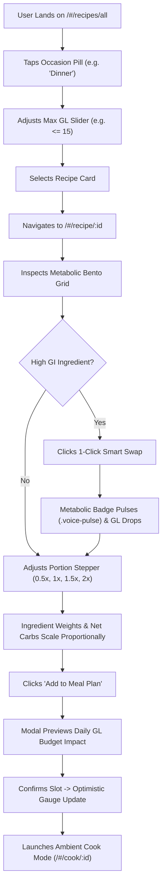
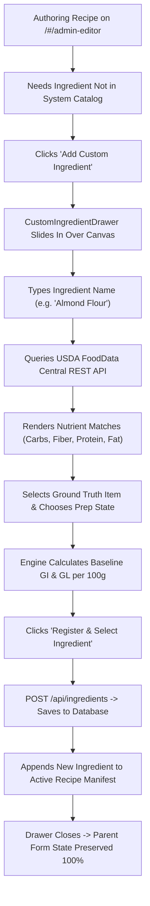
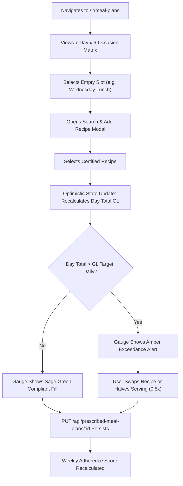
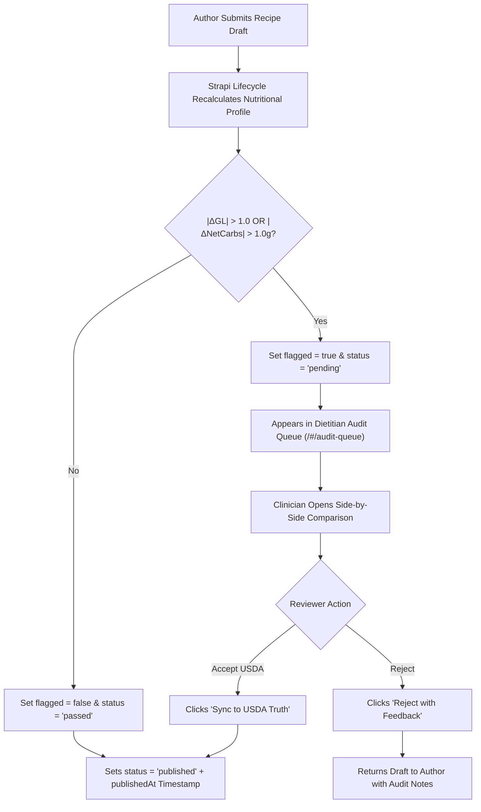

# 🧠 GlycoGourmet — User Experience, Cognitive Ergonomics & Journey Maps

> **Clinical Cognitive Ergonomics, Nielsen Norman Group Usability Heuristics, End-to-End Userflows, and Persona Journey Maps**  
> *Authored & Architected by [Fotis Pastrakis](https://fotisp.gr)*

---

## 1. Executive UX Strategy & Cognitive Ergonomics

### 1.1 The Cognitive Burden of Chronic Metabolic Management
Living with conditions such as **Type 1 Diabetes (T1D), Type 2 Diabetes (T2D), Gestational Diabetes (GDM), Prediabetes, or Severe Insulin Resistance** creates a relentless cognitive overhead. Every meal decision requires complex mental arithmetic:
- Estimating net carbohydrates (Total Carbs minus Dietary Fiber).
- Forecasting glycemic speed (effective GI influenced by food matrix and thermal cooking methods).
- Calculating postprandial glycemic excursions and insulin bolus timing.
- Balancing daily cumulative glycemic load against clinical target budgets.

Conventional dietary applications fail users by presenting raw data without clinical context, treating all carbohydrates uniformly, and forcing manual arithmetic during meal preparation.

### 1.2 Cognitive Design Principles & Human Memory Limits
GlycoGourmet eliminates metabolic decision fatigue by applying core human-computer interaction (HCI) and cognitive ergonomics principles:
1. **Preattentive Visual Processing ($< 200\text{ms}$):** Immediate chromatic feedback (Sage Green = Low GL, Amber = Med GL, Rose = High GL) allows users to assess glycemic impact subconsciously before reading numerical values.
2. **Elimination of Mental Arithmetic:** Automatic portion multipliers ($0.5\times$, $1\times$, $1.5\times$, $2\times$) and 1-Click Smart Swaps perform all net carb and GL math instantaneously.
3. **Progressive Disclosure:** Essential metabolic anchors (GL, GI, Net Carbs, Fiber) are immediately visible in the top tier of the Bento Grid; secondary micronutrients and macro breakdowns collapse into clean secondary tiers.
4. **Non-Blocking Interaction:** Creating missing ingredients or adjusting meal plans never interrupts active workflows or loses in-progress recipe drafting state.

---

## 2. Nielsen Norman Group Usability Heuristics Integration

GlycoGourmet systematically embeds all **10 Nielsen Norman UX Heuristics** into its clinical interface:

| # | Nielsen Norman Heuristic | GlycoGourmet Implementation & Cognitive Rationale |
| :--- | :--- | :--- |
| **1** | **Visibility of System Status** | **Dynamic GL Budget Gauge:** Persistent visual feedback in the header and meal scheduler dynamically updates fill width, color, and percentage as recipes are added or adjusted. |
| **2** | **Match between System and Real World** | **Natural Culinary Units:** Ingredients accept standard culinary units (`tbsp`, `cup`, `g`, `oz`) and thermal states (`sauteed`, `roasted`, `cooled`) while normalizing behind the scenes. |
| **3** | **User Control and Freedom** | **1-Click Smart Swap Rollback:** Patients can toggle between high-GI staples and clinical low-GI swaps instantly without re-entering ingredient weights. |
| **4** | **Consistency and Standards** | **Harmonized Chromatic Tokens:** Consistent color language across badges, cards, detail pages, and audit views (Green = Low GL $\le 10$, Amber = Med GL $11–19$, Rose = High GL $\ge 20$). |
| **5** | **Error Prevention** | **Non-Blocking Authoring Drawer:** Creating a custom ingredient via the USDA API occurs in an isolated slide-over drawer, preventing form reset or parent state loss. |
| **6** | **Recognition Rather than Recall** | **Smart Swap Rationale Pills:** Every ingredient substitution displays explicit clinical reasoning (e.g. *"Replaces amylopectin with brassica fiber, dropping GL from 25 to 1"*). |
| **7** | **Flexibility and Efficiency of Use** | **Discrete Serving Steppers:** Single-tap portion multipliers (`[ 0.5x ]`, `[ 1x ]`, `[ 1.5x ]`, `[ 2x ]`) eliminate mental fractions and manual ingredient math. |
| **8** | **Aesthetic and Minimalist Design** | **Progressive Disclosure Bento Grid:** Core metabolic anchors are continuously visible; secondary macros collapse into an accordion to avoid visual noise. |
| **9** | **Help Users Recognize & Recover from Errors** | **Interactive Discrepancy Badges:** The Dietitian Audit queue highlights $|\Delta| > 1.0\text{g}$ with a single-click *"Sync to USDA Truth"* button to resolve authoring errors. |
| **10**| **Help and Documentation** | **Contextual Tooltips & Ambient Cook Mode:** Inline glossary tips explain GL equations, and Cook Mode provides hands-free timers and high-contrast step instructions. |

---

## 3. End-to-End Persona Customer Journey Maps

```
+-----------------------------------------------------------------------------------+
|                            GLYCOGOURMET USER JOURNEYS                             |
+-----------------------------------------------------------------------------------+
|  [ JOURNEY 1: PATIENT ]       [ JOURNEY 2: CLINICIAN ]    [ JOURNEY 3: AUDITOR ]  |
|  - Discovery & Filtering       - Client Intake & Subtype   - Queue Ingestion      |
|  - 1-Click Smart Swap          - Target Calibration        - Side-by-Side Delta   |
|  - Discrete Portion Scaling    - 7-Day Plan Prescription   - 1-Click USDA Sync    |
|  - 7-Day Meal Scheduler        - Smart Swap Rule Setup     - Catalog Publication  |
|  - Hands-Free Cook Mode        - Adherence Telemetry       - Revision Audit Log   |
+-----------------------------------------------------------------------------------+
```

---

### Journey 1: Patient / Self-Manager (Type 1 Diabetes Daily Meal Planning)
**Persona:** Alex, 34, diagnosed with Type 1 Diabetes, balancing active lifestyle with precise glycemic insulin dosing.

| Phase | Touchpoints & Actions | User Thoughts & Needs | System Response & Feature | Emotional State |
| :--- | :--- | :--- | :--- | :---: |
| **1. Discovery** | Opens `/#/recipes/all`, selects `Dinner` chip, filters max GL $\le 15$. | *"I need a satisfying dinner that won't cause a late-night glucose spike."* | Instant faceted catalog filtering with Sage Green GL badges and macro previews. | 😊 Relieved |
| **2. Evaluation** | Clicks *Farro Salmon Bowl* to open `/#/recipe/:id`. | *"What is the exact net carb count and glycemic speed for this meal?"* | Metabolic Bento Grid displays $GL=14$, $GI=48$, $\text{NetCarbs}=22\text{g}$, $\text{Fiber}=5.5\text{g}$. | 🧐 In control |
| **3. Adaptation** | Clicks **1-Click Smart Swap** on Farro $\to$ Riced Cauliflower. | *"Can I lower the carb load further without ruining the recipe?"* | Live metabolic recalculation drops GL from $14 \to 3$; badge animates with `.voice-pulse`. | 🤩 Delighted |
| **4. Portions** | Taps `[ 1.5x ]` serving stepper to cook for partner. | *"How do I scale ingredients without recalculating all the gram weights?"* | Scaler doubles ingredient weights while keeping composite GI invariant ($28$). | 😌 Confident |
| **5. Scheduling** | Clicks *Add to Meal Plan*, selects Tuesday Dinner. | *"Will this fit into my daily cumulative GL budget?"* | Predictive modal previews budget impact; gauge fills to $38/45\text{ GL}$ (Green). | 🎯 Empowered |
| **6. Cooking** | Launches **Ambient Cook Mode** (`/#/cook/:id`). | *"I need clear, large instructions I can follow while cooking hands-free."* | High-contrast full-screen view with automated timer and large typography. | 👨‍🍳 Focused |

---

### Journey 2: Clinical Dietitian (Patient Intake, Calibration & 7-Day Prescription)
**Persona:** Dr. Sarah, Registered Dietitian Nutritionist (RDN) managing 35 diabetic patient portfolios.

| Phase | Touchpoints & Actions | Clinician Goals | System Response & Feature |
| :--- | :--- | :--- | :--- |
| **1. Intake** | Accesses Client Roster (`/#/dietitian/clients`), opens profile for Maria (GDM). | Establish patient record under strict tenant isolation. | Tenant boundary policy (`is-dietitian-owner`) ensures only assigned clients appear. |
| **2. Calibration** | Configures `MetabolicTargetCalibration`: GL Target = 40/day, Bolus Offset = 20 min. | Calibrate metabolic thresholds for Gestational Diabetes. | Real-time validation saves clinical parameters directly to patient profile. |
| **3. Prescribing** | Opens 7-Day Plan Builder (`/#/dietitian/prescriptions`), allocates 42 slots. | Build structured 7-day low-GL meal plan tailored to patient tolerance. | Interactive matrix calculates daily GL totals; warns if any day exceeds budget ($> 40\text{ GL}$). |
| **4. Rules** | Creates `SmartSwapRule`: White Bread $\to$ Sprouted Almond Bread across all plans. | Automate safe low-GI substitutions for patient discovery. | Rule applies globally to patient's catalog view with clinical rationale. |
| **5. Review** | Monitors weekly adherence gauge ($92\%$ compliance). | Assess patient stability and adjust targets during follow-up. | Visual analytics display multi-day GL adherence and postprandial stability. |

---

### Journey 3: Platform Admin / Reviewer (Recipe Discrepancy Triage & Certification)
**Persona:** Marcus, Lead Clinical Reviewer certifying community-submitted recipes.

| Phase | Touchpoints & Actions | System Event & Response |
| :--- | :--- | :--- |
| **1. Ingestion** | User authors recipe claiming $GL=6, \text{NetCarbs}=8\text{g}$. | Strapi lifecycle runs USDA recalculation: $GL=12, \text{NetCarbs}=16\text{g}$. |
| **2. Gate** | Discrepancy Gate triggers: $|\Delta GL| = 6.0 > 1.0$. | Database immutably flags record: `flagged = true`, `status = 'pending'`. |
| **3. Triage** | Reviewer opens Draft Audit Queue (`/#/audit-queue`). | Side-by-side view highlights discrepancy delta in amber alert badges. |
| **4. Resolve** | Reviewer clicks **"Sync to USDA Ground Truth"**. | Author claimed values are overwritten with verified USDA nutritional profile. |
| **5. Publish** | Reviewer clicks **"Approve & Certify Recipe"**. | Recipe transitions to `status: 'published'` with certified timestamp. |

---

## 4. End-to-End UX Userflows

### Flow 1: Recipe Discovery, Smart Swap & Portion Scaling Flow



---

### Flow 2: Non-Blocking Sub-Form Custom Ingredient Registration Flow



---

### Flow 3: 7-Day Meal Planning & Optimistic Budget Allocation Flow



---

### Flow 4: Clinical Audit & Discrepancy Resolution Flow



---

## 5. Ergonomic Interaction Patterns

### 5.1 Discrete Serving Steppers
- Multipliers: `0.5x` (Light portion / snack), `1.0x` (Standard single serving), `1.5x` (Extended active portion), `2.0x` (Partner / dual meal prep).
- **Invariance Rule:** Portions scale ingredient masses and macronutrients linearly while preserving calculated Glycemic Index ($GI$) invariantly.
- **Accessibility:** Minimum touch target size $\ge 48 \times 48\text{px}$ with clear `aria-checked` active indicators.

### 5.2 Ambient Cook Mode Ergonomics
- High-contrast display formatted for tablet/mobile kitchen stands at arm's length ($60–90\text{cm}$).
- Distraction-free full-screen modal with large step typography ($20–24\text{px}$) and touch-friendly navigation controls.
- Integrated timers attached to active cooking steps.

### 5.3 1-Click Smart Swap Rollback
- Reversible micro-interaction: Clicking *"Swap & Apply"* swaps ingredients, immediately updating GL.
- Clicking *"Revert to Original"* restores baseline ingredients without re-entering amounts or unlinking recipes from meal plans.

---

## 6. Document Metadata & Attribution

- **Document Version:** `2.0.0`
- **Lead UX Architect & Designer:** Fotis Pastrakis ([https://fotisp.gr](https://fotisp.gr))
- **Design Frameworks:** Nielsen Norman Group UX Heuristics, Sophia Prater OOUX/ORCA, WCAG 2.1 AA
