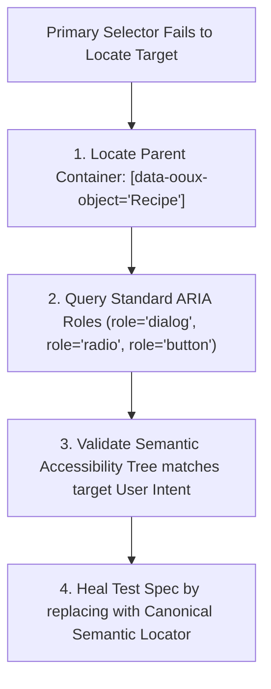
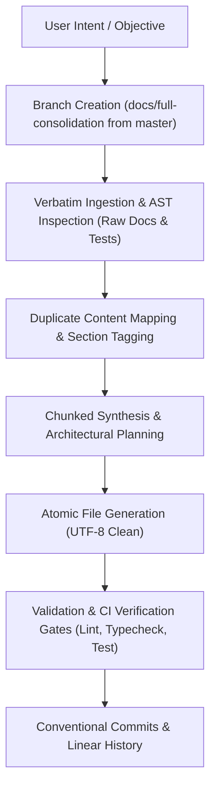

# 🤖 GlycoGourmet — Agentic QA, AI Automation & System Orchestration Directives

> **Autonomous LLM Agent Protocols, Self-Healing Selectors, Deterministic Fuzzing, and CI/CD Automation Architecture**  
> *Authored & Architected by [Fotis Pastrakis](https://fotisp.gr)*

---

## 1. Executive Directive & Automation Philosophy (QA-DIRECTIVE-2026)

**Target Systems:** GlycoGourmet Clinical Metabolic Engine & Digital Platform  
**Target Agents:** Autonomous AI Coding & QA Assistants (Antigravity, Playwright Agentic Runners, Cursor Agents)  
**Execution Standard:** Zero Tolerance for Flaky Selectors, Non-Deterministic Assertions, Silent Metabolic Drift, or Broken Invariant Gates  

### Why Autonomous Automation in Clinical Metabolic Software?
In standard web applications, small UI glitches or transient calculation inaccuracies cause minor user inconvenience. In **GlycoGourmet**, calculations dictate dietary decisions, Glycemic Load budgets, and insulin bolus timing for patients with Type 1 Diabetes, Type 2 Diabetes, Gestational Diabetes, and Insulin Resistance.

Automating verification through strict AI agent directives ensures:
1. **Deterministic Correctness:** Mathematical calculations never drift due to floating-point rounding errors or unhandled zero-division singularities.
2. **Clinical Safety Gates:** Uncertified drafts or physiologically impossible macros (e.g. Fiber > Total Carbs) can never leak into patient meal plans or public catalogs.
3. **Resilient Developer Velocity:** Self-healing selectors and semantic locator hierarchies prevent test suites from breaking during cosmetic styling refactors.
4. **Architectural Coherence:** AI agents follow structured orchestration workflows, maintaining documentation integrity and synchronized schemas.

---

## 2. Autonomous Test Agent Directives & Selector Protocols

Autonomous test agents authoring or repairing Playwright end-to-end tests must adhere strictly to the **Semantic Locator Hierarchy**. Brittle selectors that bind to layout styles or transient dynamic IDs are forbidden.

### 2.1 Strict Banning Rules
1. ❌ **NO Utility CSS Class Selectors:** Never select elements via Tailwind utility classes (e.g. `page.locator('.bg-primary.text-on-primary.p-4')`).
   - *Why:* Presentation utility classes change frequently during visual design iterations without altering semantic function.
2. ❌ **NO Hierarchical XPath Strings:** Never generate raw DOM paths (e.g. `page.locator('xpath=/html/body/div[2]/div/div[3]/button[1]')`).
   - *Why:* Minor DOM wrapper additions or flexbox adjustments instantly break hierarchical paths.
3. ❌ **NO Generated Dynamic State IDs:** Never target dynamic IDs (e.g. `id="radix-:r1:"` or `id="headlessui-menu-12"`).
   - *Why:* Dynamic IDs vary across hydration cycles, re-renders, and test runners.

---

### 2.2 Mandatory Locator Hierarchy
Agents must resolve interactive targets in descending order of precedence:

```
+-----------------------------------------------------------------------------------+
|                           MANDATORY LOCATOR HIERARCHY                             |
+---+-----------------------------+-------------------------------------------------+
| # | Locator Type                | Playwright Implementation Example               |
+---+-----------------------------+-------------------------------------------------+
| 1 | Semantic Test Identifiers   | page.locator('[data-testid="recipe-gl-badge"]') |
| 2 | Explicit ARIA Roles & Names | page.getByRole('button', { name: /Apply/i })    |
| 3 | Associated Form Labels      | page.getByLabel(/Total Carbohydrates/i)         |
| 4 | OOUX Domain Object Bindings | page.locator('[data-ooux-object="Recipe"]')     |
+---+-----------------------------+-------------------------------------------------+
```

---

### 2.3 Self-Healing Selector Protocol (OOUX Object Recovery)

When a UI refactoring breaks an existing test selector, the autonomous agent must execute the **OOUX Self-Healing Sequence** prior to failing the test run:



- **Step 1:** Locate the nearest semantic parent entity container using `[data-ooux-object="Recipe"]` or `[data-ooux-object="MealPlan"]`.
- **Step 2:** Query within that container for unambiguous standard ARIA roles (`role="button"`, `role="radio"`, `role="dialog"`).
- **Step 3:** Inspect accessible name and label properties against the accessibility tree.
- **Step 4:** Rewrite the failing spec with the newly validated canonical locator, documenting the self-healing event in test logs.

---

## 3. Synthetic Data Fuzzing & Metabolic Boundary Vectors

When authoring unit or integration test cases, test agents must systematically generate synthetic payloads testing the following 5 physiological boundary vectors:

### 3.1 Fiber Inversion Anomaly
- **Phenomenon:** Laboratory analytical assay reporting errors occasionally state dietary fiber exceeding total carbohydrates.
- **Test Vector:** `Total Carbs = 4.0g`, `Dietary Fiber = 9.0g`.
- **Required Behavior:** Deterministic engine must clamp `NetCarbs` to `0.0g` without returning negative values or `-0` (`Object.is(result, -0)` must be `false`).
- *Why:* Negative net carbs corrupt composite recipe equations and underestimate insulin requirements.

### 3.2 Thermal Multiplier Upper Bounds
- **Phenomenon:** Mechanical processing and thermal gelatinization elevate starch digestion rates.
- **Test Vector:** Ingredients with `prepState: 'mashed_processed'` ($1.25\times$) or `'boiled'` ($1.20\times$).
- **Required Behavior:** Effective GI must never exceed the theoretical ceiling of $100$.
- *Why:* GI is indexed to pure reference glucose ($100$); mathematical overflow violates clinical guidelines.

### 3.3 Floating-Point Precision Drift (IEEE 754)
- **Phenomenon:** Binary floating-point subtraction yields artifacts (e.g. `10.3333 - 3.1111 = 7.222222222222221`).
- **Test Vector:** Feed non-terminating decimal macronutrients.
- **Required Behavior:** Deterministic helper `roundToOneDecimal(val)` must clamp results strictly to 1 decimal place (`7.2g`).
- *Why:* Consistent display across UI components and prevents precision jitter during state re-renders.

### 3.4 Zero-Division Carbohydrate Singularity
- **Phenomenon:** Multi-ingredient meal composed exclusively of pure proteins and lipids ($0\text{g}$ carbohydrates, e.g. olive oil + salmon + ribeye steak).
- **Test Vector:** Recipes where $\sum NC_i = 0$.
- **Required Behavior:** Composite GI and GL must resolve to `0`. `Number.isNaN()` must be `false` and `Number.isFinite()` must be `true`.
- *Why:* Prevents runtime crashes, `NaN` badges, and invalid meal plan rollups.

### 3.5 Carbohydrate-Weighted GL Rollup Aggregation
- **Phenomenon:** Multi-meal daily rollups across breakfast, lunch, and dinner.
- **Test Vector:** Zero-carb chicken breast meal + high-carb rice bowl meal.
- **Required Behavior:** Daily cumulative GL must be weighted by carbohydrate mass rather than an unweighted arithmetic average of meal GLs.
- *Why:* Unweighted averaging incorrectly dilutes high-glycemic spikes with zero-carb meals.

---

## 4. Preattentive Visual Spectrum & Chromatic Validation

When validating chromatic compliance in automated visual regression runs, agents must verify that element background tokens map to the following HSL spectrum ranges:

```
+-----------------------------------------------------------------------------------+
|                          CHROMATIC SPECTRUM TARGETS                               |
+---------------+--------------------+------------------------+---------------------+
| Band Category | Target Hex Range   | Hue Angle Range (HSL)  | Min Contrast Ratio  |
+---------------+--------------------+------------------------+---------------------+
| Low GL        | #D8E8CB to #1B3B22 | 95° to 135° (Sage)     | 4.5:1 (AA) / 10.8:1 |
| Medium GL     | #FFE082 to #9E4D2A | 30° to 50° (Amber)     | 4.5:1 (AA) / 5.1:1  |
| High GL       | #FFDAD6 to #BA1A1A | 340° to 10° (Rose)     | 4.5:1 (AA) / 5.8:1  |
+---------------+--------------------+------------------------+---------------------+
```

- **Why:** Visual feedback processed in $< 200\text{ms}$ by the human visual cortex enables instant subconscious glycemic risk assessment, eliminating cognitive decision fatigue.

---

## 5. Antigravity Agent Orchestration & Consolidation Workflow

The **Antigravity Orchestration Engine** coordinates multi-step development, verification, and documentation consolidation:



### Key Orchestration Principles:
1. **Verbatim Ingestion First:** Ingest full raw source files before planning or refactoring to avoid hallucinations or loss of technical precision.
2. **Chunked Consolidation:** Execute complex multi-document refactoring in discrete, reviewable stages rather than massive monolithic rewrites.
3. **Reactive Task Handling:** Utilize non-blocking background command tasks for heavy test executions (`npm run test`), receiving event notifications upon completion.
4. **Encoding Integrity:** Enforce UTF-8 encoding across all programmatic file generators, preventing character corruption or BOM artifacts.

---


### 5.1 Automated Encoding & BOM Sanitization (`scripts/strip-bom.js`)
AI coding agents running on Windows environments may inadvertently emit UTF-8 Byte Order Marks (BOM). The orchestration suite provides `scripts/strip-bom.js` to audit and sanitize all root configuration files before staging commits.

## 6. Continuous Integration (CI/CD) Agent Behaviors & Validation Gates

Every Pull Request and branch merge is automatically evaluated against the automated CI pipeline gates:

```
+-----------------------------------------------------------------------------------+
|                           AUTOMATED CI/CD PIPELINE GATES                          |
+-------------------+--------------------------------+------------------------------+
| Gate Stage        | Command Execution              | Enforcement Standard         |
+-------------------+--------------------------------+------------------------------+
| 1. Static Lint    | npm run lint (Oxlint)          | Zero syntax/hook errors      |
| 2. Type Check     | npm run typecheck (tsc)        | Zero TypeScript errors       |
| 3. Unit & Invar   | npm run test (Vitest)          | 281+ tests passing (100%)    |
| 4. Accessibility  | npm run test:a11y (Playwright) | Zero WCAG 2.1 AA violations  |
| 5. User Journeys  | npm run test:e2e (Playwright)  | Complete end-to-end flows    |
| 6. DB Integrity   | npm run validate-db (Node.js)  | Nutritional invariants valid |
| 7. Pre-Commit     | npm run precommit              | Lint + Typecheck gate        |
+-------------------+--------------------------------+------------------------------+
```

---

## 7. Engineering Standards, Conventional Commits & Branching Strategy

### 7.1 Git Branching Strategy
- **`master`**: Production-ready, deployable branch. Direct pushes are protected.
- **`feat/<feature-name>`**: Feature development branches (e.g. `feat/extend-recipe-ingredient-schemas`).
- **`docs/<scope>`**: Documentation architecture and consolidation branches (e.g. `docs/full-consolidation`).
- **`fix/<bug-name>`**: Targeted bug fixes and security patches (e.g. `fix/tenant-scoping-middleware`).

---

### 7.2 Conventional Commits Specification
All commit messages must follow the [Conventional Commits](https://www.conventionalcommits.org/) specification:

```
<type>(<optional scope>): <description>

[optional body explaining architectural/clinical rationale]
```

#### Supported Types:
- **`feat`**: A new clinical feature or UI capability (e.g. `feat: implement 7-day adherence rollup calculation`).
- **`fix`**: A bug fix or security patch (e.g. `fix(deploy): remove UTF-8 BOM from netlify.toml`).
- **`docs`**: Documentation updates and architecture consolidation (e.g. `docs: create consolidated frontend engineering guide`).
- **`refactor`**: Code refactoring without behavioral alterations (e.g. `refactor: standardize calculateNetCarbs helper usage`).
- **`test`**: Adding or updating test suites (e.g. `test: add tenant scoping integration tests`).
- **`chore`**: Maintenance, dependencies, and cleanup (e.g. `chore: remove orphaned test artifacts`).

---

## 8. Agentic Balance Protocol: QA, UX & Technical Precedence (BALANCE-DIRECTIVE-2026)

### 8.1 Purpose

Sections 2–4 above establish strict QA determinism and clinical safety rules. This section adds the missing cross-functional layer: a binding rule for what autonomous agents must do when **QA rigor**, **UX trust integrity**, and **technical/architectural constraints** pull in different directions. Without this, agents default to whichever instruction was phrased most recently in a prompt, which is not an acceptable resolution strategy for a clinical-grade platform.

### 8.2 The Three Lenses

| Lens | Owns | Fails when |
|---|---|---|
| **QA** | Determinism, selector resilience, invariant gates, WCAG conformance (Sections 2–4) | A feature ships that is technically correct but flaky, inaccessible, or unverifiable |
| **UX** | Patient and Clinic-Admin trust, agency, explainability, non-punitive framing | A feature is robust and fully tested but erodes trust, feels punitive, or hides its own logic |
| **Technical** | Architecture boundaries, schema isolation, performance, maintainability | A feature satisfies QA and UX but leaks PHI across a role boundary, or violates the FHIR export isolation rule |

### 8.3 Binding Precedence Rule

When the three lenses conflict, agents must resolve in this fixed order — **Clinical/Technical Safety > UX Trust Integrity > QA Convenience**:

1. **Never violate a hard technical/clinical boundary** to satisfy QA or UX convenience. Example: an agent may not simplify a PHI-boundary check to make a Playwright test pass faster.
2. **Never sacrifice UX trust integrity to satisfy QA speed or technical elegance.** Example: an agent may not replace an explainability panel with a silent automated action just because it is fewer lines of code or fewer test cases to write.
3. **QA rigor is never optional, but its implementation must serve the above two, not override them.** Example: an agent may not add a hard block/gate in the name of "deterministic testability" when the UX spec calls for a soft, reversible, non-punitive nudge — instead the agent must find a deterministic way to test the soft version (e.g., asserting the nudge is dismissible and non-blocking, not asserting a hard stop exists).

### 8.4 Escalation Instead of Silent Override

Agents must never silently resolve a three-way conflict by picking one lens and discarding the others. When a conflict is detected, the agent must:

1. Flag the conflict explicitly in its output or commit message, not just fix it silently.
2. Propose the resolution that satisfies the Section 8.3 precedence order.
3. Log the decision as a Key Decisions Log entry rather than letting it disappear into an unremarked code diff.

### 8.5 Persona-Specific Guardrails for Agents

- **Patient-facing flows:** verify the change is reversible, explainable, and non-punitive before writing code — not just accessible (WCAG) and tested (Vitest/Playwright).
- **Clinic Admin-facing flows:** verify no clinical field is reachable from that component tree, and that any assignment/promotion/tier mutation produces an immutable audit log entry.
- **Dietitian-facing flows:** verify existing tenant isolation is preserved and that clinical export logic remains FHIR/LOINC compliant per the Section 3 fuzzing vectors.

### 8.6 CI Gate Addition

Extend the Section 6 CI/CD gate table with one new row, positioned after Accessibility and before User Journeys:

```
| Gate Stage           | Command Execution              | Enforcement Standard          |
|-----------------------|--------------------------------|--------------------------------|
| 4. Accessibility      | npm run test:a11y (Playwright) | Zero WCAG 2.1 AA violations   |
| 4.5 Trust Boundary    | npm run test:trust (Playwright)| PHI wall + consent-gate intact |
| 5. User Journeys      | npm run test:e2e (Playwright)  | Complete end-to-end flows      |
```

### 8.7 Orchestration Placement

This balance check runs at the **Plan** stage of the Section 5 Antigravity Orchestration workflow — mandatory before **Gen** (atomic file generation), not retroactively during **Gate** (validation). This preserves the existing "Verbatim Ingestion First, Chunked Consolidation" principles rather than introducing a competing workflow.

---

## 10. DAVE+R Governance & Delivery Orchestration

### 10.1 Adapter Specification

The **DAVE+R Governance & Delivery Adapter** (`gg-governance-delivery`) provides a structured change lifecycle for RBAC, tenancy, PHI boundaries, and clinical export pipeline modifications.

**Authoritative specification:** [`governance/GOVERNANCE.md`](governance/GOVERNANCE.md)

The adapter maps five DAVE+R control planes to concrete GlycoGourmet artifacts:

| Plane | Key Artifact(s) |
|---|---|
| **identity** | `usePermissions.js`, `ProtectedRoute.jsx`, RBAC state machine (`backend_dev.md` §5) |
| **data** | `PHIBoundaryBanner.jsx`, `exportPipeline.js`, tenant-scoped Strapi schemas |
| **application** | Metabolic engine (net-carb clamping, GI/GL composite, serving-multiplier) |
| **edge-api** | Public Strapi REST endpoints, recipe catalog, export pipeline |
| **ci-cd** | GitHub Actions workflows, oxlint, tsc, Vitest, Playwright |

### 10.2 Worker Invocation Sequence

Changes governed by this adapter must execute through five sequential Antigravity sub-agent workers. **No stage may be skipped**, and each worker's artifact must be committed before the next starts:

```
define-worker → architect-worker → validate-worker → execute-worker → refine-worker
```

| Worker | Stage | Output Artifact |
|---|---|---|
| `define-worker` | Define | `governance/<change-id>/01-define.md` |
| `architect-worker` | Architect | `governance/<change-id>/02-architect.md` |
| `validate-worker` | Validate | `governance/<change-id>/03-validate.md` |
| `execute-worker` | Execute | Feature branch + PR |
| `refine-worker` | Refine | `governance/<change-id>/04-refine.md` |

Templates for each artifact are in `governance/_templates/`.

### 10.3 Non-Negotiable Axioms

Five axioms are load-bearing across all workers:

1. **Gates are data, not code.** Every check is a declarative pass/fail assertion.
2. **Evidence over assertion.** Never claim a metric not just observed (test count, CI run ID, coverage).
3. **Named human owns the risk.** Default: Fotis P.
4. **Shadow before enforce.** New controls run in observe-only mode for ≥ 3 days before enforcement.
5. **Reversibility is mandatory.** One-command rollback documented before merge.

### 10.4 Session Bootstrap

When invoking an Antigravity agent for a governance change, paste this as the first message:

```text
You are running the DAVE+R Governance & Delivery cycle (adapter: gg-governance-delivery)
for the GlycoGourmet repository (ux-fotisp/GlycoGourmet).

Ground every claim in real repo state — read agentic.md, ci_cd.md, backend_dev.md §5,
SECURITY.md, and testing.md before proposing anything. Never state a test count, CI run
ID, or coverage number you have not just observed.

Execute stages in order: define-worker → architect-worker → validate-worker →
execute-worker → refine-worker. Do not skip a stage or merge to main without an
explicit human confirmation. Every control ships in shadow mode first and must have a
one-command rollback documented before merge.

Target change: <describe the specific RBAC/PHI/export/API change here>
```

### 10.5 Relationship to Existing Orchestration

This governance workflow operates **upstream** of the Section 5 Antigravity Orchestration flow. The DAVE+R cycle produces the design and evidence artifacts; the Section 5 flow then handles the actual code generation, validation gates, and commit mechanics. The Section 8 Balance Protocol (QA × UX × Technical precedence) applies within the `architect-worker` and `validate-worker` stages.

---

## 11. Document Metadata & Attribution

- **Document Version:** `2.2.0`
- **Lead Systems Architect & QA Lead:** Fotis Pastrakis ([https://fotisp.gr](https://fotisp.gr))
- **Execution Standard:** QA-DIRECTIVE-2026, BALANCE-DIRECTIVE-2026, DAVE+R-GOVERNANCE-2026, WCAG 2.1 Level AA, Conventional Commits 1.0
