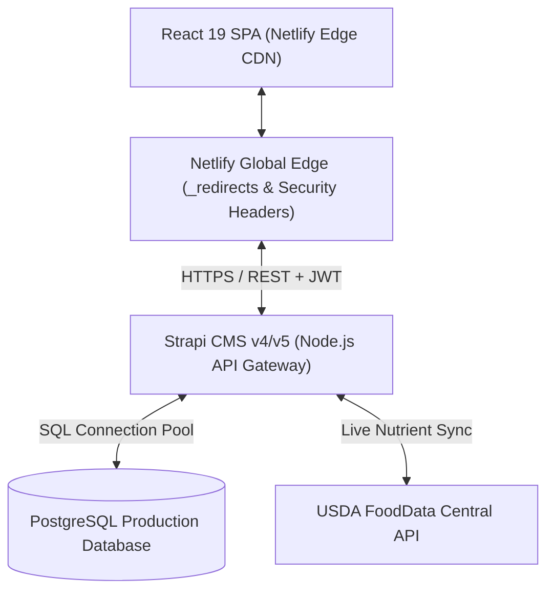

# 🛡️ GlycoGourmet — Backend Architecture, APIs & Operations Manual

> **Headless Strapi CMS Architecture, PostgreSQL Schemas, Database Lifecycle Guards, RBAC State Machine, REST API Specification, Server Directory Topology, and Production Deployment Runbook**  
> *Authored & Architected by [Fotis Pastrakis](https://fotisp.gr)*

---

## 1. System Topology & Backend Data Flow

GlycoGourmet utilizes a decoupled headless architecture where a **React 19 SPA** communicates with a **Strapi v4/v5 Headless CMS** deployed over a **PostgreSQL** persistence tier and integrated with the **USDA FoodData Central REST API**:



### Architectural Principles:
1. **Stateless JWT Authentication:** All identity validation executes via `/api/users/me` JWT bearer tokens; client-side `localStorage` role assertions are rejected.
2. **Server-Side Row-Level Tenancy:** Dietitians are strictly isolated to their assigned clients via policy intercepts and controller query overrides.
3. **Database Lifecycle Invariants:** Physiologically impossible nutritional values (e.g. negative net carbs, $GL > 100$) are trapped and rejected before database persistence.

---

## 2. Server Architecture, Directory Topology & Infrastructure

### 2.1 Server Directory Structure (`server/`)
```
server/
├── config/
│   ├── admin.js              # Admin Panel JWT secrets & token salts
│   ├── database.js           # SQLite (dev/test) & PostgreSQL (prod) connection pool
│   ├── middlewares.js        # Security headers, CORS, logger, body parser stack
│   ├── plugins.js            # Core Strapi plugin registrations
│   └── server.js             # Host (0.0.0.0), Port (1337), and APP_KEYS array
├── src/
│   ├── api/
│   │   ├── audit-record/     # Discrepancy review queue & lifecycle guards
│   │   ├── client-profile/   # Tenant-scoped patient health records
│   │   ├── ingredient/       # Master USDA ingredient registry & sync service
│   │   ├── metabolic-target-calibration/  # GL, ISF, and CIR clinical budgets
│   │   ├── prescribed-meal-plan/          # 42-slot 7-day clinical prescriptions
│   │   ├── recipe/           # Master culinary formulas & metabolic lifecycles
│   │   └── smart-swap-rule/  # Automated low-GI substitution rules
│   ├── extensions/
│   │   └── users-permissions/# User schema extension & controller sanitization
│   ├── policies/
│   │   └── is-dietitian-owner.js # Row-level tenant boundary policy
│   ├── services/
│   │   ├── metabolicEngine.js# Backend deterministic math calculator
│   │   └── usdaService.js    # USDA FoodData Central integration client
│   ├── utils/
│   │   └── giLookup.js       # Sydney University GI reference lookup table
│   └── index.js              # Strapi application bootstrap entrypoint
├── Dockerfile                # Production Alpine Linux multi-stage container
├── package.json              # Strapi v4.25.4 dependencies and scripts
└── seed.js                   # Automated database bootstrapper & permission seeder
```

---

### 2.2 Docker & Container Infrastructure

#### `server/Dockerfile`
```dockerfile
FROM node:20-alpine
RUN apk add --no-cache build-base gcc autoconf automake zlib-dev libpng-dev nasm bash vips-dev git
ARG NODE_ENV=development
ENV NODE_ENV=${NODE_ENV}
WORKDIR /opt/app
COPY package.json ./
RUN npm install
COPY . .
RUN npm run build
EXPOSE 1337
CMD ["npm", "run", "develop"]
```

#### `docker-compose.yml`
Provides an isolated local development and continuous integration environment:
```yaml
version: '3.8'

services:
  strapi:
    build:
      context: ./server
      dockerfile: Dockerfile
    container_name: glycogourmet-strapi
    restart: unless-stopped
    env_file: .env
    environment:
      DATABASE_CLIENT: ${DATABASE_CLIENT:-sqlite}
      DATABASE_FILENAME: ${DATABASE_FILENAME:-.tmp/data.db}
      JWT_SECRET: ${JWT_SECRET:-testJwtSecret}
      ADMIN_JWT_SECRET: ${ADMIN_JWT_SECRET:-testAdminSecret}
      APP_KEYS: ${APP_KEYS:-testKey1,testKey2}
      API_TOKEN_SALT: ${API_TOKEN_SALT:-testApiSalt}
      TRANSFER_TOKEN_SALT: ${TRANSFER_TOKEN_SALT:-testTransferSalt}
    ports:
      - '1337:1337'
    volumes:
      - ./server/config:/opt/app/config
      - ./server/src:/opt/app/src
      - ./server/package.json:/opt/app/package.json
      - ./server/.tmp:/opt/app/.tmp
    networks:
      - strapi-network

networks:
  strapi-network:
    driver: bridge
```

---

### 2.3 Automated Database Bootstrapper (`server/seed.js`)
Executed automatically during initial deployment and CI runs:
- Resolves the native `Authenticated` role from Users-Permissions plugin.
- Grants read/write permissions for clinical entities (`client-profile`, `metabolic-target-calibration`, `prescribed-meal-plan`, `smart-swap-rule`).
- Seeds clinical user accounts (Dietitian A, Dietitian B, Admin, Patient A).
- Ingests master ingredient items and 31 certified clinical recipes from `server/src/seeds/`.

---

## 3. Database Content-Types & Canonical Schema Registry

### 3.1 `api::recipe.recipe`
Represents master culinary formulas and patient-authored drafts:
- **`title`** (`string`, Required)
- **`description`** (`text`)
- **`mealOccasion`** (`enumeration`: `breakfast`, `brunch`, `lunch`, `dinner`, `snack`, `dessert`)
- **`prepTime`** / **`cookTime`** (`integer`, Minutes)
- **`servings`** (`integer`, Min 1)
- **`ingredients`** (`json`, Array of `RecipeIngredientItem`)
- **`instructions`** (`json`, Array of strings)
- **`nutrition`** (`json`, `MacronutrientProfile`)
- **`glycemicIndex`** (`integer`, $0–100$)
- **`glycemicLoad`** (`integer`, $0–100$)
- **`authorId`** (`string`, User reference)
- **`status`** (`enumeration`: `draft`, `published`)
- **`publishedAt`** (`datetime`, Nullable)

---

### 3.2 `api::ingredient.ingredient`
Nutritional building blocks linked to USDA FoodData Central ground truth:
- **`name`** (`string`, Required, Unique)
- **`category`** (`string`)
- **`defaultAmount`** (`decimal`)
- **`defaultUnit`** (`string`: `g`, `oz`, `cup`, `tbsp`, `tsp`)
- **`defaultPrepState`** (`enumeration`: `raw`, `steamed`, `sauteed`, `roasted`, `boiled`, `mashed_processed`, `cooled`)
- **`nutrition`** (`json`, Macronutrient profile per 100g)
- **`substitutions`** (`json`, Array of `SmartSwapPairing`)
- **`fdcId`** (`integer`, USDA FoodData Central ID)

---

### 3.3 `api::client-profile.client-profile`
Clinical patient records managed under row-level tenant boundary isolation:
- **`name`** (`string`, Patient identifier)
- **`diabeticSubtype`** (`enumeration`: `type1`, `type2`, `gestational`, `prediabetes`, `insulin_resistance`)
- **`dietitian`** (`relation`, `manyToOne` $	o$ `plugin::users-permissions.user`)
- **`calibration`** (`relation`, `oneToOne` $	o$ `api::metabolic-target-calibration`)
- **`prescriptions`** (`relation`, `oneToMany` $	o$ `api::prescribed-meal-plan`)

---

### 3.4 `api::metabolic-target-calibration.metabolic-target-calibration`
Personalized metabolic thresholds and insulin kinetics:
- **`dailyGlTarget`** (`integer`, Target daily GL budget)
- **`targetBolusOffsetMinutes`** (`integer`, Pre-meal bolus lead time)
- **`insulinSensitivityFactor`** (`decimal`, ISF $\text{mg/dL per unit}$)
- **`carbToInsulinRatio`** (`decimal`, CIR $\text{grams carb per unit}$)
- **`dietitian`** (`relation`, `manyToOne` $	o$ `plugin::users-permissions.user`)

---

### 3.5 `api::prescribed-meal-plan.prescribed-meal-plan`
Clinician-authored 7-day meal schedules (42 occasion slots):
- **`weekStartDate`** (`date`, Required)
- **`scheduledSlots`** (`json`, Mapping day of week to recipe IDs)
- **`aggregateDailyGL`** (`json`, Daily cumulative GL totals)
- **`clientProfile`** (`relation`, `manyToOne` $	o$ `api::client-profile`)
- **`dietitian`** (`relation`, `manyToOne` $	o$ `plugin::users-permissions.user`)

---

### 3.6 `api::smart-swap-rule.smart-swap-rule`
Clinician-defined low-GI substitution rules:
- **`originalIngredient`** (`relation`, `manyToOne` $	o$ `api::ingredient`)
- **`replacementIngredient`** (`relation`, `manyToOne` $	o$ `api::ingredient`)
- **`clinicalRationale`** (`text`)
- **`dietitian`** (`relation`, `manyToOne` $	o$ `plugin::users-permissions.user`)

---

### 3.7 `api::audit-record.audit-record`
Immutable verification records generated during recipe draft submission:
- **`recipeId`** (`string`, Target recipe ID)
- **`submitterId`** (`string`, Author ID)
- **`authorMacros`** (`json`, Author-claimed macronutrients)
- **`systemCalculatedMacros`** (`json`, USDA engine-calculated macronutrients)
- **`discrepancyDelta`** (`decimal`, $|GL_{\text{author}} - GL_{\text{system}}|$)
- **`status`** (`enumeration`: `pending`, `approved`, `rejected`)
- **`flagged`** (`boolean`, True when $|Delta| > 1.0$)

---

### 3.8 `plugin::users-permissions.user` (Extended User Schema)
- **`roleType`** (`enumeration`: `user`, `dietitian`, `admin`)
- **`isApproved`** (`boolean`, Default `false`)
- **`licenseId`** (`string`, RDN clinical credential)
- **`role`** (`relation`, `manyToOne` $	o$ `plugin::users-permissions.role`)

---

## 4. Database Lifecycle Invariant Guards (`lifecycles.js`)

Strapi lifecycle hooks intercept database operations, enforcing physiological constraints:

### 4.1 Recipe Validation Lifecycle (`api/recipe/content-types/recipe/lifecycles.js`)
```javascript
module.exports = {
  beforeCreate(event) {
    validateRecipePayload(event.params.data);
  },
  beforeUpdate(event) {
    validateRecipePayload(event.params.data);
  }
};

function validateRecipePayload(data) {
  if (data.ingredients && Array.isArray(data.ingredients)) {
    data.ingredients.forEach(ing => {
      if (ing.amount <= 0) {
        throw new Error("Validation Error: Ingredient weight must be strictly positive (> 0g).");
      }
    });
  }
  if (data.nutrition) {
    if (data.nutrition.fiber > data.nutrition.carbs && data.nutrition.netCarbs < 0) {
      throw new Error("Invariant Violation: Net Carbs cannot be negative.");
    }
  }
  if (data.glycemicLoad > 100) {
    throw new Error("Invariant Violation: Glycemic Load cannot exceed 100.");
  }
}
```

---

### 4.2 Discrepancy Gate Lifecycle (`api/audit-record/content-types/audit-record/lifecycles.js`)
```javascript
module.exports = {
  beforeCreate(event) {
    const { discrepancyDelta, status } = event.params.data;
    if (discrepancyDelta > 1.0) {
      event.params.data.flagged = true;
      event.params.data.status = 'pending';
    } else {
      event.params.data.flagged = false;
      if (!status) event.params.data.status = 'approved';
    }
  }
};
```

---

### 4.3 Unpublished Recipe Gate (`api/prescribed-meal-plan/content-types/prescribed-meal-plan/lifecycles.js`)
```javascript
module.exports = {
  async beforeCreate(event) {
    await validatePublishedRecipes(event.params.data, strapi);
  },
  async beforeUpdate(event) {
    await validatePublishedRecipes(event.params.data, strapi);
  }
};

async function validatePublishedRecipes(data, strapi) {
  if (!data.scheduledSlots) return;
  const slots = Object.values(data.scheduledSlots);
  for (const day of slots) {
    for (const recipeId of Object.values(day)) {
      if (recipeId) {
        const recipe = await strapi.entityService.findOne('api::recipe.recipe', recipeId);
        if (!recipe || recipe.status !== 'published' || !recipe.publishedAt) {
          throw new Error(`Invariant Violation: Cannot schedule unpublished recipe ID ${recipeId}.`);
        }
      }
    }
  }
}
```

---

## 5. Security Architecture, RBAC State Machine & Tenancy Policy

### 5.1 RBAC State Machine
```
[ User Registration (Google OAuth / Local) ]
                     │
                     ▼
      [ isApproved: false (Holding State) ]
                     │
                     ├───────────────────────────────┐
                     ▼                               ▼
       [ Admin Rejects / Ignored ]     [ Admin Approves via Control Center ]
                     │                               │
                     ▼                               ▼
          [ 403 Forbidden Gate ]        [ Assigned Role: Patient / Dietitian ]
```

---

### 5.2 Server-Side Privilege Sanitization (`extensions/users-permissions/strapi-server.js`)
Custom controller wrappers intercept registration and update payloads to prevent client-side role forgery:
```javascript
module.exports = (plugin) => {
  const sanitizeUserPayload = (body) => {
    const sanitized = { ...body };
    delete sanitized.roleType;
    delete sanitized.isApproved;
    delete sanitized.clientIds;
    delete sanitized.licenseId;
    return sanitized;
  };

  const originalUpdate = plugin.controllers.user.update;
  plugin.controllers.user.update = async (ctx) => {
    if (ctx.state.user.roleType !== 'admin') {
      ctx.request.body = sanitizeUserPayload(ctx.request.body);
    }
    return originalUpdate(ctx);
  };

  return plugin;
};
```

---

### 5.3 Row-Level Tenancy Policy & Controller Overrides (`is-dietitian-owner.js`)
Controllers implement the canonical Strapi v4 tenant-scoping pattern:
```javascript
module.exports = createCoreController("api::client-profile.client-profile", ({ strapi }) => ({
  async find(ctx) {
    const user = ctx.state.user;

    // 1. Validate and sanitize client-supplied query parameters
    await this.validateQuery(ctx);
    const sanitizedQuery = await this.sanitizeQuery(ctx);

    // 2. Server-enforce tenant boundary filter for dietitians
    if (user && user.roleType === "dietitian") {
      sanitizedQuery.filters = {
        ...(sanitizedQuery.filters || {}),
        dietitian: user.id,
      };
    }

    // 3. Query persistence tier via entityService
    const entities = await strapi.entityService.findMany(
      "api::client-profile.client-profile",
      sanitizedQuery
    );

    // 4. Sanitize and transform output response
    const sanitizedOutput = await this.sanitizeOutput(entities, ctx);
    return this.transformResponse(sanitizedOutput);
  }
}));
```

---

## 6. Complete REST API Specification & Endpoint Contracts

### 6.1 Authentication Endpoints
- **`POST /api/auth/local`**: Authenticates user via email/password; returns JWT and user profile.
- **`POST /api/auth/local/register`**: Registers new account (sets `isApproved: false` by default).
- **`GET /api/users/me`**: Returns profile for bearer token owner with populated role relations.
- **`PUT /api/users/:id`**: Updates profile; non-admins have privilege escalation fields sanitized.

---

### 6.2 Clinical Entity Endpoints

| Resource Route | Method | Access Level | Description |
| :--- | :---: | :---: | :--- |
| `/api/recipes` | `GET` | Public / All | List published recipes (`?publicationState=preview` for drafts). |
| `/api/recipes` | `POST` | Authenticated | Create recipe draft (`status = 'draft'`). |
| `/api/recipes/:id` | `GET` | Public / All | Get single recipe by ID with populate. |
| `/api/recipes/:id` | `PUT` | Author / Admin | Update recipe draft or publish. |
| `/api/ingredients` | `GET` | Public / All | Search master ingredient database. |
| `/api/ingredients` | `POST` | Authenticated | Create custom ingredient linked to USDA FoodData Central. |
| `/api/client-profiles` | `GET` | Dietitian / Admin | List tenant-scoped client profiles. |
| `/api/client-profiles` | `POST` | Dietitian / Admin | Create client record and associate calibration. |
| `/api/prescribed-meal-plans` | `GET` | Dietitian / Client| Retrieve 7-day 42-slot prescriptive meal plan. |
| `/api/prescribed-meal-plans` | `POST` | Dietitian / Admin | Prescribe 7-day meal plan (unpublished recipe gate enforced). |
| `/api/audit-records` | `GET` | Dietitian / Admin | Retrieve discrepancy triage queue ($|Delta| > 1.0	ext{g}$). |
| `/api/audit-records/:id/resolve` | `POST` | Dietitian / Admin | 1-Click sync author draft to USDA ground truth. |

---

## 7. Production Operations, Deployment Runbook & Disaster Recovery

### 7.1 Environment Variable Master Matrix

#### Netlify Frontend Production Environment:
```env
VITE_STRAPI_URL=https://api.glycogourmet.com
VITE_USDA_API_KEY=live_usda_production_token
VITE_ENABLE_DEMO_AUTH=false
VITE_APP_ENV=production
```

#### Strapi CMS Production Environment:
```env
HOST=0.0.0.0
PORT=1337
APP_KEYS=prodKey1,prodKey2,prodKey3,prodKey4
API_TOKEN_SALT=secureProductionApiTokenSalt
ADMIN_JWT_SECRET=secureProductionAdminJwtSecret
TRANSFER_TOKEN_SALT=secureProductionTransferTokenSalt
JWT_SECRET=secureProductionUserJwtSecret
DATABASE_CLIENT=postgres
DATABASE_HOST=postgres.production.internal
DATABASE_PORT=5432
DATABASE_NAME=glycogourmet_prod
DATABASE_USERNAME=glyco_admin
DATABASE_PASSWORD=secureDatabasePassword
DATABASE_SSL=true
```

---

### 7.2 Deployment Phases

#### Phase A: Backend CMS & Database Provisioning
1. Provision PostgreSQL database instance.
2. Deploy Strapi container via Docker / Kubernetes:
   ```bash
   docker build -t glycogourmet-server:latest ./server
   docker run -d --name glycogourmet-api -p 1337:1337 --env-file .env.production glycogourmet-server:latest
   ```
3. Verify backend health endpoint: `curl -I https://api.glycogourmet.com/_health` (returns `HTTP 204`).

#### Phase B: Netlify Edge Frontend Deployment
1. Build production static bundle: `npm run build`
2. Verify `dist/_redirects` exists (`/* /index.html 200`).
3. Deploy to Netlify Edge CDN via Netlify CLI or GitHub Actions automated webhook.

---

### 7.3 HTTP Security Headers (`netlify.toml`)
```toml
[[headers]]
  for = "/*"
  [headers.values]
    X-Frame-Options = "DENY"
    X-Content-Type-Options = "nosniff"
    X-XSS-Protection = "1; mode=block"
    Referrer-Policy = "strict-origin-when-cross-origin"
    Permissions-Policy = "camera=(), microphone=(), geolocation=()"
    Content-Security-Policy = "default-src 'self'; script-src 'self' 'unsafe-inline'; style-src 'self' 'unsafe-inline' https://fonts.googleapis.com; font-src 'self' https://fonts.gstatic.com; img-src 'self' data: https:; connect-src 'self' https://api.glycogourmet.com https://api.nal.usda.gov;"
```

---

### 7.4 Disaster Recovery: PostgreSQL Backup & Restoration

#### Automated Backup Command (`pg_dump`):
```bash
pg_dump -h $DATABASE_HOST -U $DATABASE_USERNAME -d $DATABASE_NAME -F c -b -v -f /backups/glycogourmet_$(date +%Y%m%d_%H%M%S).dump
```

#### Restoration Command (`pg_restore`):
```bash
pg_restore -h $DATABASE_HOST -U $DATABASE_USERNAME -d $DATABASE_NAME -v -c /backups/glycogourmet_target_restore.dump
```

---


### 7.5 Build & Encoding Sanitization (`scripts/strip-bom.js`)
To prevent deployment failures caused by invisible UTF-8 Byte Order Marks (BOM) in configuration files (`netlify.toml`, `package.json`, `tsconfig.json`), run the automated BOM sanitizer:
```bash
node scripts/strip-bom.js
```
This utility safely strips the leading `\xEF\xBB\xBF` byte sequence without altering content formatting.

## 8. Document Metadata & Attribution

- **Document Version:** `2.0.0`
- **Backend Lead & Systems Architect:** Fotis Pastrakis ([https://fotisp.gr](https://fotisp.gr))
- **Core Technologies:** Strapi v4/v5, PostgreSQL 16, Node.js 20 LTS, Docker, Netlify CDN
