# 🚀 GlycoGourmet — CI/CD Automation & Workflow Specification

> **GitHub Actions Pipelines, Verification Gates, Live CI Execution Telemetry, and Production Deployment Automation**  
> *Authored & Architected by [Fotis Pastrakis](https://fotisp.gr)*

---

## 1. CI/CD Architecture & Pipeline Overview

GlycoGourmet enforces automated continuous verification across every commit and Pull Request. The CI/CD architecture is structured into two primary GitHub Actions workflows located in `.github/workflows/`:

```mermaid
flowchart TD
    subgraph Triggers ["Trigger Events"]
        PR["Pull Request to main"]
        Push["Push to main / release/*"]
    end

    subgraph ProductionPipeline ["production-pipeline.yml"]
        Stage1["1. Static Analysis, Lint & Secret Audit (oxlint, tsc, secret check)"]
        Stage2["2. Deterministic Unit Gate (Vitest with 100% coverage on engine)"]
        Stage3["3. WCAG 2.1 AA & Contrast Audits (Axe-core on Chromium)"]
        Stage4["4. Multi-Browser E2E Matrix (Chromium, Firefox, WebKit)"]
        Stage5["5. Production Build & Netlify SPA Integrity (_redirects check)"]
    end

    subgraph IntegrationPipeline ["integration-tests.yml"]
        BootStrapi["Boot Live Strapi v4.25.4 on SQLite"]
        SeedDB["Execute server/seed.js (Users, Roles, Permissions)"]
        HealthCheck["Poll http://localhost:1337/_health (Wait for 204)"]
        RunInteg["Execute TenantScopingIntegration.spec.js"]
        LogArtifacts["Upload strapi.log & Test Results (7-day retention)"]
    end

    PR --> ProductionPipeline
    PR --> IntegrationPipeline
    Push --> ProductionPipeline
    Push --> IntegrationPipeline
    Stage1 --> Stage2 --> Stage3 --> Stage4 --> Stage5
    BootStrapi --> SeedDB --> HealthCheck --> RunInteg --> LogArtifacts
```



---

## 2. Production CI/CD Pipeline (`production-pipeline.yml`)

**Workflow File:** `.github/workflows/production-pipeline.yml`  
**Execution Environment:** `ubuntu-latest` (Node.js 22 LTS)  
**Triggers:** Push to `main`, `release/*`; Pull Requests targeting `main`  
**Concurrency Policy:** `cancel-in-progress: true` (cancels redundant runs on rapid pushes)

### Detailed Execution Stages:

#### Stage 1: Static Analysis, Strict Typecheck & Secret Audit
- **Dependency Installation:** `npm ci` with cached npm packages.
- **Secret & Key Audit:** `npm audit --audit-level=high` and regex scanning for accidental hardcoded API tokens (`sk_live`, `AIzaSy`).
- **Linter Execution:** `npx oxlint src/` verifies zero syntax errors, dead code, or unhandled React hook dependencies.
- **TypeScript Typecheck:** `npx tsc --noEmit` validates domain interface integrity without compiling artifacts.

#### Stage 2: Deterministic Unit Gate (100% Coverage Thresholds)
- **Execution Target:** `tests/unit/metabolicEngine.spec.ts`
- **Enforcement Standard:** Strict 100% coverage across all 4 metrics:
  $$\text{Lines: } 100\%, \quad \text{Functions: } 100\%, \quad \text{Branches: } 100\%, \quad \text{Statements: } 100\%$$
- **Invariant Scope:** Traps Net Carbs negative clamping, thermal prep multipliers ($1.00\times - 1.25\times, 0.85\times$), and zero-carb singularity protections.

#### Stage 3: WCAG 2.1 AA Accessibility & Contrast Audits
- **Tooling:** Playwright + `@axe-core/playwright` running on Desktop Chromium.
- **Target:** `tests/a11y/contrastAudit.spec.ts`
- **Audited Constraints:**
  - Zero WCAG 2.1 AA accessibility violations across all primary routes.
  - Primary deep green gradients (`#1B3B22` and `#2D5A34`) maintain $ge 4.5:1$ text contrast against backgrounds.
  - Interactive touch targets meet minimum bounding dimensions ($ge 48 \times 48\text{px}$).

#### Stage 4: Multi-Browser End-to-End Integration Matrix
- **Matrix Configuration:** `[chromium, firefox, webkit]` with `fail-fast: false`.
- **Target:** `tests/e2e/metabolicJourneys.spec.ts`
- **Tested User Journeys:**
  1. Single-recipe GI/GL rendering and secondary macro expansion.
  2. Persona A (Type 1 Manager) low-GL filtering and 1-Click Smart Swap.
  3. Persona C (Dietitian Audit) macro discrepancy triage and 1-Click USDA synchronization.
  4. RBAC gate interception redirecting unapproved users to `/pending-approval`.
- **Failure Telemetry:** Playwright traces, screenshots, and failure videos uploaded with 14-day retention.

#### Stage 5: Production Build & Netlify SPA Integrity Gate
- **Build Execution:** `npm run build` generates production-optimized ES modules and hashed chunks in `dist/`.
- **SPA Redirect Verification:** Asserts existence of `dist/_redirects` with exact rule `/*    /index.html   200` to prevent client-side 404 routing failures on Netlify Edge CDN.

---

## 3. Strapi Backend Integration Pipeline (`integration-tests.yml`)

**Workflow File:** `.github/workflows/integration-tests.yml`  
**Execution Environment:** `ubuntu-latest` (Node.js 20 LTS)  
**Triggers:** Push to `main`; Pull Requests targeting `main`  

### Detailed Pipeline Workflow:
1. **Public Uploads Directory:** Creates `server/public/uploads` to satisfy Strapi media upload plugin prerequisites.
2. **Database Seeding:** Executes `node seed.js` in `./server` with SQLite (`.tmp/data.db`), seeding clinical test roles, users (Dietitian A/B, Admin, Patient), ingredients, and master recipes.
3. **Background Boot:** Boots Strapi backend in background (`npm run develop > ../strapi.log 2>&1 &`) on port `1337`.
4. **Health Check Polling:** Polls `http://localhost:1337/_health` every 5 seconds (up to 30 attempts, 150s max) until `HTTP 204` is returned.
5. **Integration Assertion:** Runs `npx vitest run tests/integration/TenantScopingIntegration.spec.js`.
6. **Log Archival:** In the event of failure or success, archives `strapi.log` and `test-results/` as GitHub Actions artifacts for 7 days.

---

## 4. Live CI Runs & Tenant Isolation Verification (Runs 33079017457 & 33079705050)

The row-level tenant boundary isolation policy (`is-dietitian-owner.js`) and controller override patterns were verified live on GitHub Actions across two certified execution runs:

| Run ID | Workflow | Commit Reference | Status | Certified Invariants & Telemetry |
| :--- | :--- | :--- | :---: | :--- |
| **`33079017457`** | `integration-tests.yml` | `813e852` (feat(auth)) | ✅ **SUCCESS** | Booted Strapi v4.25.4; verified Dietitian B JWT issuance; verified `GET /api/client-profiles` returns HTTP 200 with 0 records (Dietitian A records completely hidden). |
| **`33079705050`** | `integration-tests.yml` | `e87027c` (docs: sync PRD) | ✅ **SUCCESS** | Confirmed full green suite across tenant scoping assertions: Dietitian A profile retrieval ($>0$), Admin cross-tenant visibility ($>0$), and Patient role rejection (HTTP 403/401). |

```
Certified CI Scenarios (Runs 33079017457 & 33079705050):
  ✓ Step A: Dietitian B authenticates via POST /api/auth/local and receives valid JWT
  ✓ Step B: GET /api/client-profiles with Dietitian B token returns HTTP 200 with data: []
  ✓ Step C: GET /api/client-profiles with Dietitian A token returns HTTP 200 with Dietitian A profiles
  ✓ Step D: GET /api/client-profiles with Admin token returns HTTP 200 with all cohort profiles
  ✓ Step E: GET /api/client-profiles with Patient token is rejected with HTTP 403 Forbidden
```

---

## 5. Local Quality Gate Execution Commands

Developers and automated agents can reproduce the exact CI gate verification locally:

```bash
# 1. Run Pre-Commit Quality Gate (Oxlint + Strict Typecheck)
npm run precommit

# 2. Run Deterministic Unit & Invariant Test Suite
npm run test

# 3. Run Axe-Core Automated WCAG 2.1 AA Accessibility Audit
npm run test:a11y

# 4. Run Multi-Browser End-to-End Playwright Scenarios
npm run test:e2e

# 5. Run Database Nutritional Ground Truth Validation
npm run validate-db
```

---

## 6. Document Metadata & Attribution

- **Document Version:** `2.0.0`
- **DevOps & Systems Architect:** Fotis Pastrakis ([https://fotisp.gr](https://fotisp.gr))
- **CI/CD Platform:** GitHub Actions, Playwright Test Runner, Vitest, Netlify CDN
