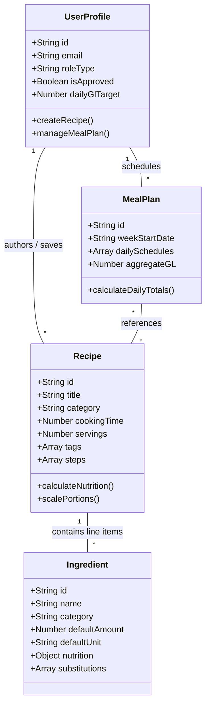
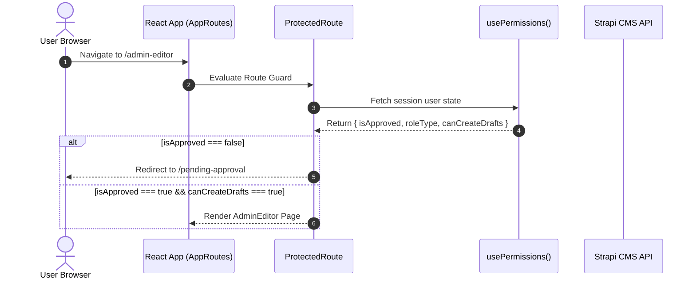

# 🏛️ GlycoGourmet — Technical Architecture & UX Specification

> **Architected & Authored by [Fotis Pastrakis](https://fotisp.gr)**  
> *Deep-dive technical specification detailing the OOUX domain architecture, metabolic calculation algorithms, Strapi RBAC security matrix, HCI research principles, and system routing layer.*

---

## Section 1: Object-Oriented UX (OOUX) Domain Architecture

GlycoGourmet is structured around Sophia Prater's **Object-Oriented UX (OOUX) / ORCA framework** (Objects, Relationships, CTA Actions, Attributes). The domain model centers around four core domain objects: `Recipe`, `Ingredient`, `Meal Plan`, and `User Profile`.



### 1.1 Object Matrix & Lifecycle Breakdown

| Object | Core Metadata & Attributes | Nested Relationships | Lifecycle States |
|---|---|---|---|
| **Recipe** | `title`, `description`, `category`, `cookingTime`, `servings`, `imageUrl`, `tags`, `steps` | Has-many `Ingredient` line items (with quantity, unit, `prepState`) | `Draft` $\rightarrow$ `Pending Audit` $\rightarrow$ `Published Public` $\rightarrow$ `Archived` |
| **Ingredient** | `name`, `category`, `defaultAmount`, `defaultUnit`, `nutrition` (`kcal`, `carbs`, `fiber`, `netCarbs`, `gi`) | Has-many `substitutions` (alternative ingredient references with swap rationale) | `System Core` $\mid$ `User-Authored Custom` |
| **Meal Plan** | `weekStartDate`, `dailySchedules` (Mon-Sun arrays of Breakfast, Lunch, Dinner, Snack slots) | References multiple `Recipe` objects; calculates daily GL sums | `Active Week` $\rightarrow$ `Completed` $\rightarrow$ `Template` |
| **User Profile**| `email`, `roleType` (`user`, `dietitian`, `admin`), `isApproved`, `dailyGlTarget`, `unitSystem` | Has-many `Recipe` drafts; owns `MealPlan` schedule; stores `Favorites` | `Pending Audit` $\rightarrow$ `Approved Active` $\rightarrow$ `Suspended` |

---

## Section 2: Metabolic Engine & Math Algorithms

GlycoGourmet provides 100% calculation accuracy for postprandial glucose estimation through deterministic mathematical formulas.

### 2.1 Mathematical Formulas

#### 1. Net Carbohydrate Formula:
$$\text{Net Carbs} = \max(0, \text{Total Carbs} - \text{Dietary Fiber})$$

#### 2. Thermal Preparation Multiplier ($M_{\text{prep}}$):
Digestive starch accessibility changes based on heat and cooling. The effective Glycemic Index for ingredient $i$ is calculated as:
$$GI_{\text{effective}, i} = GI_{\text{base}, i} \times M_{\text{prep}, i}$$

Where $M_{\text{prep}}$ is defined by preparation state:
- `raw`: $1.00$
- `steamed`: $1.02$
- `sauteed`: $1.05$
- `roasted`: $1.15$ (high heat increases rapid starch gelatinization)
- `boiled`: $1.20$
- `mashed_processed`: $1.25$
- `cooled`: $0.85$ (retrogradation forms resistant starch)

#### 3. Composite Recipe Glycemic Index:
Weighted average GI based on carbohydrate weight contribution:
$$\text{Weighted GI} = \frac{\sum_{i=1}^{n} \left( GI_{\text{effective}, i} \times \text{Carbs}_i \right)}{\sum_{i=1}^{n} \text{Carbs}_i}$$

#### 4. Portion-Scaled Glycemic Load ($GL$):
$$\text{Base GL} = \text{Math.round}\left(\frac{\text{Weighted GI} \times \text{Net Carbs}}{100}\right)$$
$$\text{Scaled GL} = \text{Math.round}\left(\text{Base GL} \times S_{\text{multiplier}}\right)$$

### 2.2 Preattentive Color Severity System

To minimize cognitive load, GlycoGourmet translates GL numbers into preattentive visual encoding:

| GL Value Range | Category Label | Visual Token | Tailored Utility Class | Clinical Meaning |
|---|---|---|---|---|
| **$\text{GL} \le 10$** | **Gentle Impact** | Sage Green | `bg-primary` / `text-primary` | Minimal postprandial glucose fluctuation |
| **$11 \le \text{GL} \le 19$** | **Moderate Impact** | Amber / Copper | `bg-tertiary` / `text-tertiary` | Moderate, gradual glucose elevation |
| **$\text{GL} \ge 20$** | **High Spike Risk** | Soft Rose | `bg-error` / `text-error` | Rapid glucose spike risk; caution advised |

---

## Section 3: Strapi CMS Backend & RBAC Security Matrix

GlycoGourmet enforces a strict Role-Based Access Control (RBAC) matrix driven by the user's `isApproved` flag and `roleType`.

### 3.1 Permission Matrix Table

| Role Type | `isApproved` | `canCreateDrafts` | `canPublishPublic` | `canManageUsers` | `isPendingAudit` | Navigation Access |
|---|---|---|---|---|---|---|
| **Pending Audit** | `false` | `false` | `false` | `false` | `true` | Redirected to `/pending-approval` |
| **Authenticated User** | `true` | `true` | `false` | `false` | `false` | Access to `/recipes/mine`, `/meal-plans` |
| **Dietitian** | `true` | `true` | `true` | `false` | `false` | Can publish directly to public library |
| **Admin** | `true` | `true` | `true` | `true` | `false` | Full access + `/admin` user management |



### 3.2 Google OAuth2 & Admin Audit Workflow
1. **Registration**: User registers via Google OAuth2 or email signup.
2. **Holding State**: New accounts default to `isApproved: false`.
3. **Audit Redirect**: Unapproved users attempting to access protected routes are intercepted by `ProtectedRoute` and redirected to `/pending-approval`.
4. **Admin Approval**: Administrators access `/admin` to inspect user credentials, verify clinical licenses (for Dietitians), and toggle `isApproved: true`.

---

## Section 4: Human-Computer Interaction (HCI) Research Basis

GlycoGourmet's user interface is grounded in published HCI research on cognitive ergonomics, decision fatigue, and preattentive visual processing.

### 4.1 Core HCI Principles & Design Implementations

1. **Cognitive Fatigue Reduction (Zero Mental Math)**:
   - *Rationale*: Individuals managing chronic conditions experience high daily decision fatigue.
   - *Implementation*: Discrete 48px portion touch pills (`[ 0.5x ]`, `[ 1x ]`, `[ 1.5x ]`, `[ 2x ]`) allow single-tap portion scaling. All macro adjustments occur programmatically without manual multiplication.

2. **Recognition Over Recall**:
   - *Rationale*: Recalling numerical glycemic indices taxes working memory.
   - *Implementation*: Visual bento grids, category icons (`set_meal`, `grain`, `eco`), and pre-filtered dietary tags present visual recognition anchors.

3. **Preattentive Visual Encoding**:
   - *Rationale*: Visual processing of color and fill width occurs in under 200ms before conscious attentional focus.
   - *Implementation*: Preattentive chromatic GL progress meter (`h-3 rounded-full bg-surface-container-high overflow-hidden`) displays color-coded spike risk instantly.

4. **Non-Blocking Context Preservation**:
   - *Rationale*: Navigating away from an active form disrupts task momentum and increases input errors.
   - *Implementation*: Custom ingredients are registered via a non-blocking slide-over drawer (`CustomIngredientDrawer.jsx`), keeping the recipe authoring canvas state intact.

---

## Section 5: Navigation & Information Architecture

The application's route hierarchy enforces security gating while maintaining clean navigation flow:

```
AppRoutes
 ├── /                        (Dashboard & Public Recipe Explorer)
 ├── /recipes/:id             (Detail Hero, Stepper, Bento Grid, Cook Mode)
 ├── /pending-approval        (Holding screen for unapproved accounts)
 ├── /login                   (Authentication & OAuth entry)
 ├── /onboarding               (Diabetic profile & unit preference setup)
 └── ProtectedRoute Gated Routes
      ├── /recipes/mine       [requiredPermission: canCreateDrafts]
      ├── /admin-editor       [requiredPermission: canCreateDrafts]
      ├── /meal-plans         [requiredPermission: canCreateDrafts]
      ├── /settings           [Requires authenticated session]
      └── /admin              [requiredPermission: canManageUsers]
```

---

## 👨‍💻 Author & Technical Attribution

Designed, architected, and engineered by **[Fotis Pastrakis](https://fotisp.gr)**.
