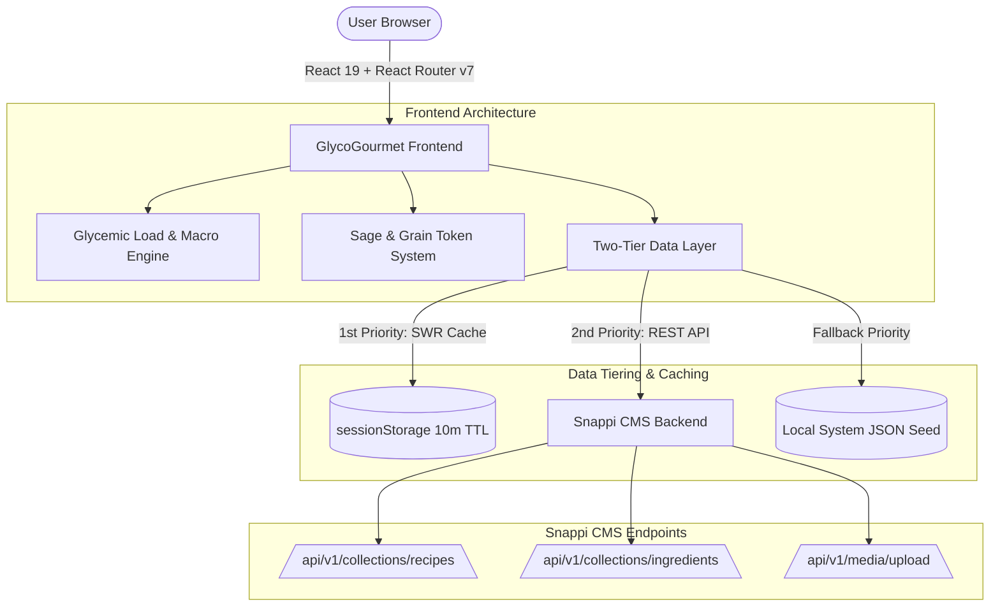

# 🏛️ GlycoGourmet — Technical Architecture & Snappi CMS Integration Guide

> **Architected by [Fotis Pastrakis](https://fotisp.gr)**  
> *Comprehensive technical documentation for the GlycoGourmet headless nutrition application, Snappi CMS REST API integration, Glycemic Load calculation engine, and Netlify deployment pipeline.*

---

## 1. System Architecture Overview

GlycoGourmet is structured as a decoupled, headless web application:



---

## 2. Snappi CMS Integration & Schemas

### 2.1 Client Layer (`src/services/snappiClient.js`)
- **Native Fetch Wrapper**: Centralized API abstraction handles authorization, header construction, JSON serialization, and error handling.
- **Stale-While-Revalidate (SWR) Caching**:
  - `snappiGet()` reads cached responses from `sessionStorage` with a **10-minute TTL** (`CACHE_TTL_MS = 600,000`).
  - Returns cached content immediately for fast rendering, then revalidates in the background.
  - Automatic cache invalidation (`invalidateCache()`) triggers after `POST`, `PUT`, or `DELETE` operations.

### 2.2 Endpoint Reference

| Method | Endpoint | Authorization | Description |
|---|---|---|---|
| `GET` | `/collections/recipes` | `Bearer <READ_TOKEN>` | Fetch recipe collection |
| `GET` | `/collections/recipes/:id` | `Bearer <READ_TOKEN>` | Fetch single recipe detail |
| `POST` | `/collections/recipes` | `Bearer <USER_JWT>` | Create new recipe draft |
| `PUT` | `/collections/recipes/:id` | `Bearer <USER_JWT>` | Update existing recipe |
| `DELETE` | `/collections/recipes/:id` | `Bearer <USER_JWT>` | Delete recipe |
| `GET` | `/collections/ingredients` | `Bearer <READ_TOKEN>` | Fetch ingredient registry |
| `POST` | `/collections/ingredients` | `Bearer <USER_JWT>` | Register custom ingredient |
| `POST` | `/media/upload` | `Bearer <USER_JWT>` | Multipart image upload (`FormData`) |

### 2.3 Data Schemas

#### **Recipe Schema (`Recipe`)**
```json
{
  "id": "crispy-salmon-asparagus",
  "title": "Crispy Skin Salmon with Roasted Asparagus",
  "category": "Main Course",
  "description": "Pan-seared salmon fillet paired with garlic-roasted asparagus.",
  "cookingTime": 25,
  "servings": 2,
  "imageUrl": "https://images.unsplash.com/photo-1519708227418-c8fd9a32b7a2",
  "tags": ["Low GI", "Keto", "High Protein"],
  "ingredients": [
    {
      "ingredientId": "atlantic-salmon",
      "amount": 6,
      "unit": "oz",
      "prepState": "raw"
    },
    {
      "ingredientId": "asparagus",
      "amount": 1,
      "unit": "bunch",
      "prepState": "roasted"
    }
  ],
  "steps": [
    {
      "title": "Prep Veggies",
      "description": "Snap off woody ends of asparagus and toss with olive oil.",
      "timer": 5
    }
  ]
}
```

#### **Ingredient Schema (`Ingredient`)**
```json
{
  "id": "atlantic-salmon",
  "name": "Atlantic Salmon",
  "category": "protein",
  "defaultUnit": "oz",
  "defaultAmount": 6,
  "nutrition": {
    "kcal": 180,
    "protein": 34,
    "fat": 5,
    "carbs": 0,
    "fiber": 0,
    "netCarbs": 0,
    "glycemicIndex": null,
    "glycemicLoad": 0
  },
  "substitutions": []
}
```

---

## 3. Glycemic Load (GL) Calculation Engine

### 3.1 Mathematical Model (`src/utils/nutritionCalculator.js`)

#### **Glycemic Index (GI) Weighting**:
$$\text{Weighted GI} = \frac{\sum \left( \text{GI}_i \times \text{PrepMultiplier}_i \times \text{Carbs}_i \right)}{\sum \text{Carbs}_i}$$

#### **Glycemic Load (GL) Formula**:
$$\text{GL} = \text{Math.round}\left(\frac{\text{Weighted GI} \times \text{Net Carbs}}{100}\right)$$

### 3.2 Preparation-State GI Multipliers

The digestive accessibility of starches varies based on cooking and cooling states:

| Prep State | Multiplier | Biological Impact |
|---|---|---|
| `raw` | `1.00` | Baseline glycemic response |
| `steamed` | `1.05` | Mild gelatinization of starches |
| `roasted` | `1.15` | High heat increases rapid starch breakdown |
| `cooled` | `0.85` | Retrogradation forms resistant starch (lowers GI) |

### 3.3 Glycemic Load Classification Spectrum

| Category | Numerical Range | Visual Accent | UI Class |
|---|---|---|---|
| **Low GL** | $\text{GL} \le 10$ | Sage Green Accent | `text-primary-fixed-dim` / `bg-primary-container/15` |
| **Medium GL** | $11 \le \text{GL} \le 19$ | Warm Copper Accent | `text-tertiary` / `bg-tertiary-container/15` |
| **High GL** | $\text{GL} \ge 20$ | High Warning Accent | `text-error` / `bg-error-container/15` |

---

## 4. Security & Authentication Architecture

- **JWT Session Storage**: User session tokens are stored in `localStorage.getItem('glyco_session')`.
- **Dynamic Header Injection**:
  - `snappiClient` automatically attaches `Authorization: Bearer <USER_JWT>` for write methods (`POST`, `PUT`, `DELETE`).
  - Read queries default to public bearer token (`VITE_SNAPPI_READ_TOKEN`).
- **Defensive Input Handling**: All numeric fields utilize `safeNum()` and `safeNullableNum()` wrappers to guarantee incomplete CMS draft payloads never break UI rendering.

---

## 5. Design System ("Sage & Grain")

Sourced from the Google Stitch accessibility specification:
- **Primary Color**: `#325346` (Sage Green)
- **Tertiary Color**: `#803615` (Muted Copper)
- **Error Color**: `#ba1a1a` (Spike Warning Red)
- **Background**: `#f7faf8` (Warm Oat White)
- **Typography**: Plus Jakarta Sans scale with 8px grid system alignment.
- **Accessibility**: Strict WCAG 2.1 AA 4.5:1 contrast compliance across badges, pills, and dark mode overlays.

---

## 6. Deployment & Continuous Integration

- **Hosting Platform**: Netlify (Continuous Deployment linked to `ux-fotisp/GlycoGourmet`).
- **SPA Routing**: Configured via `public/_redirects` (`/* /index.html 200`) and root `netlify.toml`.
- **Automated Verification**: Vitest unit test suite (32 tests covering calculation, state management, and component rendering) and Vite 8 production compiler (`npm run build`).

---

## 👨‍💻 Creator & Diabetes Context

**GlycoGourmet** was designed and engineered by **[Fotis Pastrakis](https://fotisp.gr)** as a personalized digital health solution for diabetes management and postprandial glucose stability.
