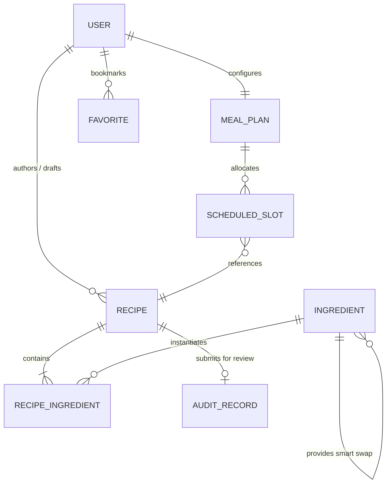

# 🧠 GlycoGourmet — Information Architecture & Clinical HCI Specification

> **Object-Oriented UX (OOUX / ORCA), Cognitive Ergonomics, and Preattentive Design Directives**  
> *Authored for GlycoGourmet (React 19, Tailwind CSS v4, Strapi v4/v5 CMS)*

---

## 1. Executive IA Strategy & Cognitive Ergonomics

### 1.1 Clinical Problem Statement: Chronic Metabolic Decision Fatigue
Individuals living with **Type 1 Diabetes, Type 2 Diabetes, Gestational Diabetes, Prediabetes, or Severe Insulin Resistance** face continuous cognitive strain. Every food choice requires multi-variable mental arithmetic: estimating carbohydrate quantities, calculating dietary fiber offsets, assessing glycemic speed, predicting postprandial glycemic excursions, and calculating insulin or medication boluses.

Conventional dietary applications exacerbate cognitive burnout by:
1. Treating all carbohydrates as metabolically uniform (ignoring glycemic kinetics and food matrix effects).
2. Presenting overwhelming, unstructured databases of unverified crowd-sourced recipes.
3. Forcing users into complex multi-step arithmetic workflows during active meal planning and cooking.

### 1.2 The Action-Oriented Triad (Deprecation of Generic Dashboard)
To eliminate cognitive friction, GlycoGourmet replaces the traditional, passive "analytics dashboard" with an **Action-Oriented Triad**:

```
+-----------------------------------------------------------------------------------+
|                            GLYCOGOURMET ACTION TRIAD                              |
+-----------------------------------------------------------------------------------+
| 1. Discovery Catalog       | 2. Personal Studio         | 3. Daily Scheduler      |
|    Route: /recipes/all     |    Route: /recipes/mine    |    Route: /meal-plans   |
|    • Preattentive GL badges|    • Non-blocking authoring|    • Real-time GL budget|
|    • 6-Occasion filtering  |    • USDA live search sync |    • 7-day visual matrix|
|    • 1-Click Smart Swaps   |    • Draft & publish states|    • Instant macro tally|
+-----------------------------------------------------------------------------------+
```

---

## 2. Object-Oriented UX (OOUX) & ORCA Framework Mapping

Applying Sophia Prater’s **Object-Oriented UX (OOUX) / ORCA framework** (Objects, Relationships, Calls-to-Action, Attributes), the clinical system model is structured as follows:

### 2.1 Core Domain Objects



### 2.2 Structural Relationships & Multiplicity Matrix

| Primary Object | Related Object | Cardinality | Business & Clinical Rules |
| :--- | :--- | :---: | :--- |
| **`User`** | `Recipe` (Authored) | $1 : N$ | Users author recipes as `draft`. Only verified Clinicians/Admins can publish publicly. |
| **`User`** | `MealPlan` | $1 : 1$ | Each patient maintains a continuous 7-day scheduled plan tracked against their daily GL target. |
| **`Recipe`** | `Ingredient` | $N : M$ | Recipes aggregate multiple ingredients with specific gram weights and thermal prep states. |
| **`Ingredient`** | `Ingredient` (Swap) | $1 : N$ | High/Med-GI ingredients define clinical Smart Swap alternatives that drop net GL. |
| **`Recipe`** | `AuditRecord` | $1 : 0..1$ | Recipes with author/USDA discrepancies $> 1.0\text{g}$ trigger an audit record in the Dietitian Queue. |

### 2.3 Persona-Specific Calls-to-Action (CTA) Matrix

```
+--------------------------------------------------------------------------------------------------------+
| OBJECT       | PATIENT / CAREGIVER             | CLINICAL DIETITIAN            | PLATFORM ADMINISTRATOR|
+--------------------------------------------------------------------------------------------------------+
| Recipe       | • 1-Click Smart Swap            | • Ingest from USDA Ground Truth| • Approve / Reject    |
|              | • Scale Portions (0.5x - 2.0x)  | • Review Discrepancy Delta    | • Feature on Catalog  |
|              | • Add to Daily Meal Plan        | • Author Clinical Prescriptions| • Revoke Publishing  |
|              | • Launch Hands-Free Cook Mode   | • Calibrate Thermal Prep GI   | • Audit Change Log    |
+--------------------------------------------------------------------------------------------------------+
| Ingredient   | • View Physiological Rationale  | • Register Custom Ingest      | • Manage Taxonomy     |
|              | • Select Low-GI Swap Option     | • Validate Nutrient Profile   | • Purge Duplicate Data|
+--------------------------------------------------------------------------------------------------------+
| MealPlan     | • Allocate Meal Occasion Slot   | • Prescribe 7-Day Target Plan | • Export Manifest     |
|              | • Monitor Daily GL Budget Gauge | • Analyze Aggregate Stability | • Calibrate Thresholds|
+--------------------------------------------------------------------------------------------------------+
| AuditRecord  | • View Review Status (Draft)    | • Overwrite with USDA Truth   | • Force Resolution    |
|              | • Amend Discrepancies           | • Publish Certified Recipe    | • Set Discrepancy Gate|
+--------------------------------------------------------------------------------------------------------+
```

### 2.4 Attribute Taxonomy

```
Recipe Entity
├── Core Metadata
│   ├── id: String (Slug / UUID)
│   ├── title: String
│   ├── description: String
│   ├── category: String (e.g., "Entrée", "Salad", "Bowl")
│   ├── mealOccasion: Enum (breakfast | brunch | lunch | dinner | snack | dessert)
│   ├── prepTime: Number (Minutes)
│   ├── cookTime: Number (Minutes)
│   ├── servings: Number (Default: 1)
│   └── imageUrl: String (URI)
├── Physiological & Metabolic Metrics
│   ├── glycemicIndex: Number (0 - 100, Net-Carb Weighted)
│   ├── glycemicLoad: Number (0 - 100, Clamped per serving)
│   ├── glycemicImpact: Enum ("Optimal Low-GI" | "Moderate Impact" | "High Spike Risk")
│   └── nutrition: MacronutrientProfile (kcal, protein, fat, carbs, fiber, netCarbs)
├── Dietary & Clinical Flags
│   └── dietaryFlags: Array<String> (e.g., "Gluten-Free", "Keto", "High Fiber", "Dairy-Free")
└── Semantic Tags
    └── tags: Array<String> (e.g., "#UltraLowGL-2", "#HighProtein", "#LOGI", "#MealPrep")
```

---

## 3. Nielsen Norman Group Usability Heuristics Integration

GlycoGourmet systematically embeds the **10 Nielsen Norman Usability Heuristics** into its interaction architecture:

| # | Nielsen Norman Heuristic | GlycoGourmet Implementation & Cognitive Rationale |
|---|---|---|
| **1** | **Visibility of System Status** | **Dynamic GL Budget Gauge:** Persistent visual feedback in header and meal planner dynamically updates fill width and color as items are added. |
| **2** | **Match between System and Real World** | **Natural Culinary Units:** Ingredients accept standard culinary units (`tbsp`, `cup`, `g`, `oz`) and thermal states (`sauteed`, `roasted`, `cooled`) while normalizing behind the scenes. |
| **3** | **User Control and Freedom** | **1-Click Smart Swap Rollback:** Patients can toggle between high-GI staples and clinical swaps instantly without re-entering ingredient weights. |
| **4** | **Consistency and Standards** | **Harmonized Chromatic Tokens:** Consistent color language across badges, cards, detail pages, and audit views (Green = Low GL, Amber = Med GL, Red = High GL). |
| **5** | **Error Prevention** | **Non-Blocking Authoring Drawer:** Creating a custom ingredient from USDA API occurs in an isolated slide-over drawer, preventing form reset or state loss. |
| **6** | **Recognition Rather than Recall** | **Smart Swap Rationale Pills:** Every ingredient substitution displays explicit clinical reasoning (e.g., *"Replaces amylopectin with brassica fiber, dropping GL from 25 to 1"*). |
| **7** | **Flexibility and Efficiency of Use** | **Discrete Serving Steppers:** Single-tap portion multipliers (`[ 0.5x ]`, `[ 1x ]`, `[ 1.5x ]`, `[ 2x ]`) eliminate mental fractions and manual ingredient math. |
| **8** | **Aesthetic and Minimalist Design** | **Progressive Disclosure Bento Grid:** Core metabolic anchors (GL, GI, Net Carbs, Fiber) are continuously visible; secondary macros (Calories, Fat, Protein) collapse into an accordion. |
| **9** | **Help Users Recognize & Recover from Errors** | **Interactive Discrepancy Badges:** The Dietitian Audit queue highlights $|\Delta| > 1.0\text{g}$ with a single-click *"Sync to USDA Truth"* button to resolve authoring errors. |
| **10**| **Help and Documentation** | **Contextual Tooltips & Ambient Cook Mode:** Inline glossary tips explain GL equations, and Cook Mode provides hands-free timers and high-contrast step instructions. |

---

## 4. Taxonomies, Meal Occasion Segmentation & Search Ergonomics

### 4.1 6-Occasion Meal Taxonomy
To mirror natural circadian metabolic rhythms, recipes are categorized into exactly 6 clinical occasions:

```
┌─────────────────────────────────────────────────────────────────────────────────────────────┐
│ 1. Breakfast (06:00 - 10:00) │ Gentle morning insulin sensitivity; emphasis on low dawn GL. │
├──────────────────────────────┼──────────────────────────────────────────────────────────────┤
│ 2. Brunch    (10:00 - 13:00) │ Balanced proteins and healthy fats for extended fasting.     │
├──────────────────────────────┼──────────────────────────────────────────────────────────────┤
│ 3. Lunch     (12:00 - 15:00) │ Sustained midday energy with low postprandial fatigue.       │
├──────────────────────────────┼──────────────────────────────────────────────────────────────┤
│ 4. Dinner    (17:00 - 21:00) │ High-satiety, low-glycemic evening load to prevent nocturnal │
│                              │ glucose spikes and the Somogyi effect.                       │
├──────────────────────────────┼──────────────────────────────────────────────────────────────┤
│ 5. Snack     (Intermittent)  │ Fiber-dense, portion-controlled bridge foods (GL <= 5).      │
├──────────────────────────────┼──────────────────────────────────────────────────────────────┤
│ 6. Dessert   (Postprandial)  │ Zero-sugar, fat/fiber-buffered treats with minimal spike.    │
└─────────────────────────────────────────────────────────────────────────────────────────────┘
```

### 4.2 Dynamic Semantic Tag Generation Engine
The system generates automated metadata tags based on calculated metabolic properties:
* **`#UltraLowGL-{N}`**: Triggered when $GL \le 5$ (e.g. `#UltraLowGL-2`).
* **`#SpikeSafe`**: Triggered when $GI \le 35$ and $NC \le 10\text{g}$.
* **`#HighFiber`**: Triggered when $\text{Fiber} \ge 6.0\text{g}$ per serving.
* **`#KetoOptimal`**: Triggered when $NC \le 5.0\text{g}$ and $\text{Fat} \ge 65\%$ of calories.

---

## 5. Preattentive Chromatic Visual Feedback (WCAG 2.1 AA Compliant)

### 5.1 Preattentive Visual Spectrum
GlycoGourmet leverages human preattentive visual processing (preattentive visual attributes processed in $< 200\text{ms}$ by the human visual cortex):

```
Glycemic Load (GL) Spectrum:
0 ──────────────── 10 ──────────────── 19 ──────────────── 100+
[   LOW GL (<= 10)  ] [  MED GL (11-19)  ] [   HIGH GL (>= 20)  ]
[    SAGE GREEN     ] [     AMBER        ] [     SOFT ROSE      ]
[   #1B3B22 / #386A20] [     #9E4D2A      ] [      #BA1A1A       ]
[  "Gentle Impact"  ] [ "Moderate Impact"] [ "High Spike Risk"  ]
```

### 5.2 Accessibility & Contrast Certification Matrix

| Semantic Token | Hex Code | Background | Contrast Ratio | WCAG 2.1 AA Status |
| :--- | :--- | :--- | :---: | :---: |
| **Deep Pine (`--color-pine-900`)** | `#1B3B22` | Grain Ivory (`#F6F4EE`) | **$10.8 : 1$** | ✅ Passes (Exceeds AAA) |
| **Glyco Sage (`--color-sage-700`)** | `#386A20` | Soft Sage (`#D8E8CB`) | **$4.8 : 1$** | ✅ Passes (Exceeds AA) |
| **Forest Moss (`--color-moss-800`)** | `#2D5A34` | Soft Sage (`#D8E8CB`) | **$5.4 : 1$** | ✅ Passes (Exceeds AA) |
| **Amber (`--color-tertiary`)** | `#9E4D2A` | Amber Container (`#FFDBCF`) | **$5.1 : 1$** | ✅ Passes (Exceeds AA) |
| **Error Rose (`--color-error`)** | `#BA1A1A` | Error Container (`#FFDAD6`) | **$5.8 : 1$** | ✅ Passes (Exceeds AA) |

---

## 6. Document Metadata & Attribution

- **Document Version:** `1.0.0`
- **Architect & Author:** Fotis Pastrakis ([https://fotisp.gr](https://fotisp.gr))
- **Compliance Standard:** WCAG 2.1 Level AA, Nielsen Norman Group UX Heuristics
