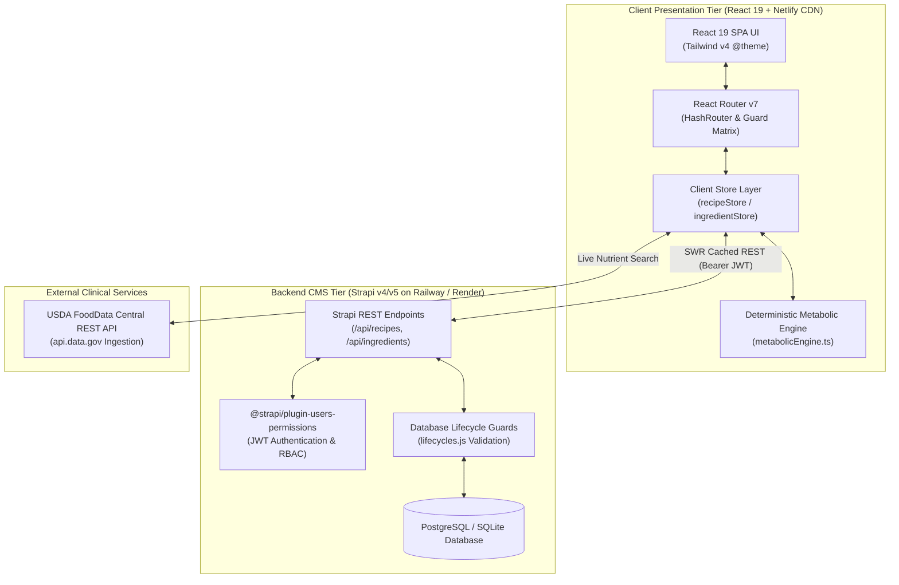

# ⚙️ GlycoGourmet — Technical Architecture & Systems Engineering Directive

> **Clinical-Grade Deterministic Computation, TypeScript Domain Contracts, and Cloud Infrastructure**  
> *Authored for GlycoGourmet (React 19, Tailwind CSS v4, Strapi v4/v5 CMS, Netlify SPA)*

---

## 1. System Topology & Data Flow Boundaries

GlycoGourmet is engineered as a decoupled, clinical-grade Single Page Application (SPA) backed by a headless Strapi CMS data layer with integrated USDA FoodData Central telemetry:



---

## 2. Deterministic Metabolic Math Engine Specification

All nutritional calculations are strictly deterministic, isolated from side effects, and protected against floating-point drift (IEEE 754 precision trapping) and zero division.

### 2.1 Net Carbohydrates Clamping Invariant
Dietary fiber cannot be broken down into monosaccharides by human digestive enzymes. However, when laboratory analytical methods report total fiber exceeding total carbohydrates, mathematical negative values must be strictly clamped to zero:

$$\text{NetCarbs}(C, F) = \max\left(0, \operatorname{round}_{1}(C - F)\right)$$

*Where $C \ge 0$ is total carbohydrates (g), $F \ge 0$ is dietary fiber (g), and $\operatorname{round}_{1}(x) = \frac{\operatorname{round}(x \times 10)}{10}$.*

### 2.2 Thermal Starch Gelatinization & Retrogradation Multipliers
Cooking methods directly alter starch crystallinity and enzymatic accessibility. The engine applies an empirical coefficient $M_{\text{prep}}$ to baseline Glycemic Index ($GI_0$):

$$GI_{\text{effective}} = \operatorname{clamp}\left(0, 100, \operatorname{round}\left(GI_0 \times M_{\text{prep}}\right)\right)$$

$$\begin{array}{l|c|l}
\textbf{Preparation State} & \textbf{Multiplier } (M_{\text{prep}}) & \textbf{Biochemical Mechanism} \\
\hline
\text{raw} & 1.00\times & \text{Baseline intact cellular wall and native starch granules.} \\
\text{steamed} & 1.02\times & \text{Mild moist heat softens hemicellulose with minimal rupture.} \\
\text{sauteed} & 1.05\times & \text{Moderate dry-moist heat with lipid encapsulation slowing digestion.} \\
\text{roasted} & 1.15\times & \text{Sustained dry heat promotes extensive starch gelatinization.} \\
\text{boiled} & 1.20\times & \text{Hydrothermal swelling causes complete amylopectin leaching.} \\
\text{mashed\_processed} & 1.25\times & \text{Mechanical shear + cooking maximizes enzymatic surface area.} \\
\text{cooled} & 0.85\times & \text{Retrogradation re-crystallizes amylose into resistant starch (RS3).}
\end{array}$$

### 2.3 Composite Recipe Glycemic Index ($GI_{\text{recipe}}$)
The recipe-level glycemic index is the carbohydrate-weighted average of all constituent ingredients. If total net carbs equal zero, zero division is defensively trapped:

$$GI_{\text{recipe}} = \begin{cases} 
0 & \text{if } \sum_{i=1}^{n} NC_i = 0 \\
\operatorname{round}\left(\frac{\sum_{i=1}^{n} (GI_{\text{effective}, i} \times NC_i)}{\sum_{i=1}^{n} NC_i}\right) & \text{if } \sum_{i=1}^{n} NC_i > 0 
\end{cases}$$

### 2.4 Recipe Glycemic Load per Serving ($GL_{\text{recipe}}$)
Glycemic Load measures the real physiological glucose impact per consumed portion:

$$GL_{\text{recipe}} = \operatorname{clamp}\left(0, 100, \operatorname{round}\left(\frac{GI_{\text{recipe}} \times \sum_{i=1}^{n} NC_i}{100 \times S}\right)\right)$$

*Where $S \ge 1$ is the number of servings.*

---

## 3. Domain Data Contracts & TypeScript Interfaces

```typescript
/**
 * Core Macronutrient Profile Interface
 */
export interface MacronutrientProfile {
  kcal: number;
  protein: number;
  fat: number;
  saturatedFat?: number;
  carbs: number;
  fiber: number;
  netCarbs: number;
  glycemicIndex?: number;
  glycemicLoad?: number;
}

/**
 * Thermal Preparation State Discriminator
 */
export type PrepState =
  | 'raw'
  | 'steamed'
  | 'sauteed'
  | 'roasted'
  | 'boiled'
  | 'mashed_processed'
  | 'cooled';

/**
 * Smart Low-GI Swap Definition
 */
export interface SmartSwapPairing {
  ingredientId: string;
  name: string;
  reason: string;
  expectedGlReduction?: number;
}

/**
 * Master Ingredient Entity
 */
export interface Ingredient {
  id: string;
  name: string;
  category: 'protein' | 'grain' | 'vegetable' | 'fat' | 'dairy' | 'legume' | 'fruit' | 'seasoning' | 'cheese';
  defaultAmount: number;
  defaultUnit: 'g' | 'oz' | 'cup' | 'tbsp' | 'tsp' | 'piece' | 'bunch' | 'clove';
  defaultPrepState: PrepState;
  nutrition: MacronutrientProfile;
  substitutions?: SmartSwapPairing[];
  isUserAuthored?: boolean;
  fdcId?: number; // USDA FoodData Central Reference
}

/**
 * Recipe Ingredient Manifest Item
 */
export interface RecipeIngredientItem {
  ingredientId: string;
  amount: number;
  unit: string;
  prepState: PrepState;
  customName?: string;
}

/**
 * Master Clinical Recipe Entity
 */
export interface Recipe {
  id: string;
  title: string;
  description: string;
  category: string;
  mealOccasion: 'breakfast' | 'brunch' | 'lunch' | 'dinner' | 'snack' | 'dessert';
  prepTime: number;
  cookTime: number;
  servings: number;
  yield?: string;
  imageUrl?: string;
  status: 'draft' | 'published';
  publishedAt?: string | null;
  authorId?: string;
  ingredients: RecipeIngredientItem[];
  instructions: string[];
  dietaryFlags?: string[];
  tags?: string[];
  glycemicIndex: number;
  glycemicLoad: number;
  glycemicImpact: 'Optimal Low-GI' | 'Moderate Impact' | 'High Spike Risk';
  nutrition: MacronutrientProfile;
}

/**
 * User Meal Plan Schedule
 */
export interface MealPlan {
  id: string;
  userId: string;
  weekStartDate: string;
  scheduledSlots: {
    [dayOfWeek: string]: {
      breakfast?: string; // Recipe ID
      lunch?: string;
      dinner?: string;
      snack?: string;
    };
  };
  aggregateDailyGL: { [dayOfWeek: string]: number };
}

/**
 * Dietitian Audit Record
 */
export interface AuditRecord {
  id: string;
  recipeId: string;
  submitterId: string;
  submittedAt: string;
  authorMacros: MacronutrientProfile;
  systemCalculatedMacros: MacronutrientProfile;
  discrepancyDelta: number; // |GL_author - GL_system|
  status: 'pending' | 'approved' | 'rejected';
  rejectionReason?: string;
}
```

---

## 4. State Management & Lifecycle Architecture

### 4.1 URL Search Parameter Synchronization (`useRecipeFilters.js`)
Catalog filter states (`occasion`, `sort`, `maxGL`) are synchronized bidirectionally with the browser query string:

$$\text{URLSearchParams} \underset{\text{deserialization}}{\overset{\text{serialization}}{\longleftrightarrow}} \text{React State } (\text{occasion}, \text{sortOrder}, \text{maxGL})$$

* **Deep Linking Support:** Sharing URLs (`/#/recipes/all?occasion=lunch&maxGL=10&sort=gl-asc`) immediately restores filtered catalog views.
* **Debounced Navigation:** Rapid slider interactions debounce URL updates by $150\text{ms}$ to prevent history stack thrashing.

### 4.2 Isolated Sub-Form Drawer Pattern (`CustomIngredientDrawer.jsx`)
When authors need an ingredient missing from the system catalog:
1. `CustomIngredientDrawer` slides out over the authoring canvas as an **isolated sub-form**.
2. USDA API queries execute in an independent execution context.
3. Upon registration, the new ingredient is POSTed to `/api/ingredients`, added to the active recipe’s ingredient manifest, and closed **without unmounting or resetting parent form state**.

### 4.3 Telemetry & Event-Driven Smart Swaps (`SmartSwapTrigger.jsx`)
When a user executes a Smart Low-GI Swap:
1. The component replaces the active ingredient item ID with the swap alternative.
2. The deterministic metabolic calculation pipeline recalculates composite $GL$ and $GI$.
3. An active CSS pulse (`.voice-pulse`) highlights the updated metric in the Nutrition Snapshot badge.

---

## 5. Security, RBAC & Database Invariant Guards

### 5.1 Role-Based Access Control (RBAC) State Machine

```mermaid
stateDiagram-v2
    [*] --> Unauthenticated
    Unauthenticated --> Authenticated : Login / Register
    Authenticated --> PendingApproval : isApproved === false
    PendingApproval --> /pending-approval : Intercept & Lock Navigation
    Authenticated --> PatientTier : isApproved === true && role === 'user'
    Authenticated --> DietitianTier : isApproved === true && role === 'dietitian'
    Authenticated --> AdminTier : isApproved === true && role === 'admin'

    PatientTier --> PersonalWorkspace : Can Author Drafts
    DietitianTier --> AuditQueue : Can Review & Publish
    AdminTier --> FullControl : Full Publishing & User Elevation
```

### 5.2 Strapi Backend Lifecycle Invariant Guards (`lifecycles.js`)
The Strapi database layer enforces strict rejection of physiologically invalid payloads prior to database commit:

```javascript
// server/src/api/recipe/content-types/recipe/lifecycles.js
module.exports = {
  beforeCreate(event) {
    validateRecipePayload(event.params.data);
  },
  beforeUpdate(event) {
    validateRecipePayload(event.params.data);
  }
};

function validateRecipePayload(data) {
  if (data.ingredients) {
    data.ingredients.forEach(ing => {
      if (ing.amount <= 0) {
        throw new ApplicationError("Ingredient weight must be strictly positive (> 0g).");
      }
    });
  }
  if (data.nutrition) {
    if (data.nutrition.fiber > data.nutrition.carbs && data.nutrition.netCarbs < 0) {
      throw new ApplicationError("Invariant Violation: Net Carbs cannot be negative.");
    }
  }
  if (data.glycemicLoad > 100) {
    throw new ApplicationError("Invariant Violation: Glycemic Load cannot exceed 100.");
  }
}
```

---

## 6. Infrastructure, Caching & Netlify SPA Routing

### 6.1 Netlify Build & CDN Routing Pipeline
* **Build Execution:** `npm run build` generates bundled JS/CSS artifacts in `dist/`.
* **SPA Fallback:** `dist/_redirects` (`/* /index.html 200`) ensures client-side routing handles all deep URLs.

### 6.2 HTTP Security & Privacy Headers (`netlify.toml`)
* `X-Frame-Options: DENY`: Prevents UI redressing and clickjacking attacks.
* `X-Content-Type-Options: nosniff`: Prevents MIME-type confusion vulnerabilities.
* `Content-Security-Policy`: Restricts resource ingestion to approved origins (Google Fonts, Unsplash, Strapi, USDA `api.data.gov`).
* `Permissions-Policy`: Hardens sandbox by disabling unnecessary device hardware APIs (`camera=(), microphone=(), geolocation=()`).

### 6.3 Asset Cache Invalidation Architecture
* **Hashed Production Chunks (`/assets/*`):** `Cache-Control: public, max-age=31536000, immutable` (Infinite cache; content hash prevents stale assets).
* **HTML Entrypoint (`/index.html`):** `Cache-Control: public, max-age=0, must-revalidate` (Guarantees immediate zero-downtime updates upon redeployment).

---

## 7. Document Metadata & Attribution

- **Document Version:** `1.0.0`
- **Lead Systems Architect:** Fotis Pastrakis ([https://fotisp.gr](https://fotisp.gr))
- **Repository:** `https://github.com/fotispastrakis/GlycoGourmet`
