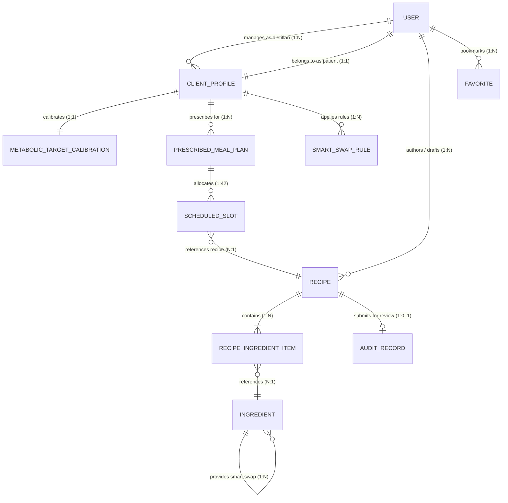

# 🌿 GlycoGourmet — Information Architecture & Clinical Data Specification

> **Clinical Digital Health Platform Architecture, Cognitive Ergonomics, OOUX / ORCA Domain Models, and System Schema Specification**  
> *Authored & Architected by [Fotis Pastrakis](https://fotisp.gr)*

---

## 1. Executive IA Strategy & Cognitive Ergonomics

### 1.1 Clinical Problem Statement: Chronic Metabolic Decision Fatigue
Individuals managing **Type 1 Diabetes (T1D), Type 2 Diabetes (T2D), Gestational Diabetes (GDM), Prediabetes, or Severe Insulin Resistance** experience perpetual cognitive friction surrounding nutrition. Every dietary intake event demands multi-variable mental calculation:
- Estimating carbohydrate quantities and dietary fiber offsets.
- Gauging glycemic speed (rate of glucose entry into the bloodstream).
- Forecasting postprandial glycemic excursions and insulin/medication requirements.
- Accounting for culinary preparation methods and food matrix interactions.

Conventional dietary software aggravates user burnout by:
1. **Treating carbohydrates as metabolically homogeneous**, ignoring thermal starch gelatinization, fiber matrix buffering, and effective glycemic index (GI).
2. **Presenting unstructured, noisy catalogs** of unvalidated crowd-sourced recipes with conflicting nutritional claims.
3. **Forcing users into multi-step arithmetic workflows** during meal planning and cooking, increasing error rates and decision fatigue.

### 1.2 Cognitive Design Principles & The Action-Oriented Triad
GlycoGourmet deprecates the traditional, passive "analytics dashboard" in favor of the **Action-Oriented Triad**. The interface is structured around three direct-action workspaces mapped to user intent:

```
+-----------------------------------------------------------------------------------+
|                            GLYCOGOURMET ACTION TRIAD                              |
+-----------------------------------------------------------------------------------+
| 1. Discovery Catalog       | 2. Personal Studio         | 3. Daily Scheduler      |
|    Route: /#/recipes/all   |    Route: /#/my-recipes    |    Route: /#/meal-plans |
|      Preattentive GL badges|      Non-blocking authoring|      Real-time GL budget|
|      6-Occasion filtering  |      USDA live search sync |      7-day visual matrix|
|      1-Click Smart Swaps   |      Draft & publish states|      Instant macro tally|
+-----------------------------------------------------------------------------------+
```

1. **Discovery Catalog (`/#/` / `/#/recipes/all`):** Rapid exploration of clinically certified recipes with instant preattentive Glycemic Load (GL) chromatic badges, 6-occasion meal segmentation, and 1-Click Smart Low-GI Swaps.
2. **Personal Studio (`/#/my-recipes` / `/#/admin-editor`):** Distraction-free recipe authoring with an isolated sub-form drawer for USDA FoodData Central ingredient search, preventing lost form state and maintaining clear draft/published separation.
3. **Daily Scheduler (`/#/meal-plans`):** 7-day interactive planning matrix with real-time cumulative GL budget gauges and carbohydrate-weighted daily rollups.

---

## 2. Clinical Persona Taxonomy & Access Control Matrix

### 2.1 Persona Specifications

```
+-----------------------------------------------------------------------------------+
|                             GLYCOGOURMET PERSONA TIERS                            |
+-----------------------------------------------------------------------------------+
|  [ PATIENT / CLIENT ]        [ CLINICAL DIETITIAN ]      [ PLATFORM ADMIN ]       |
|  - T1D, T2D, GDM, Prediabetes - Cohort management        - User role approval     |
|  - Daily GL budget pacing    - Target calibrations       - Catalog certification  |
|  - 1-Click Smart Swaps       - Prescribed meal plans     - System invariant guard |
|  - Personal draft authoring  - Custom swap rule setup    - Global taxonomy curator|
|  - Hands-free Cook Mode      - Audit queue discrepancy   - Full publishing rights |
+-----------------------------------------------------------------------------------+
```

#### Persona A: Patient / Client (Metabolic Self-Manager)
- **Clinical Profile:** Diagnosed with Type 1 Diabetes, Type 2 Diabetes, Gestational Diabetes, Prediabetes, or Severe Insulin Resistance.
- **Primary Goals:**
  - Maintain daily Glycemic Load within clinical target bounds without manual arithmetic.
  - Execute 1-Click Smart Swaps to replace high-spike ingredients with low-GI alternatives.
  - Scale recipe portions ($0.5\times - 2.0\times$) with invariant glycemic calculations.
  - Author personal recipe drafts in a private workspace.
  - Cook seamlessly using high-contrast, hands-free Ambient Cook Mode.
- **Cognitive Ergonomics:** Requires preattentive chromatic cues ($<200\text{ms}$ visual processing), immediate feedback on GL impact, and zero arithmetic barrier.

#### Persona B: Clinical Dietitian (Care Provider & Prescriber)
- **Clinical Profile:** Registered Dietitian Nutritionist (RDN), Certified Diabetes Care and Education Specialist (CDCES), or Endocrinologist.
- **Primary Goals:**
  - Manage multiple client profiles under strict tenant isolation.
  - Configure `MetabolicTargetCalibration` (daily GL target, net carb caps, bolus offset timing) customized to patient diabetic subtype.
  - Prescribe structured 7-day `PrescribedMealPlan` schedules across 42 addressable meal slots.
  - Author bespoke `SmartSwapRule` substitutions tailored to patient metabolic tolerance.
  - Review author-submitted recipe discrepancies ($|\Delta| > 1.0\text{g}$) in the Dietitian Audit Queue and synchronize with USDA ground truth.
- **Cognitive Ergonomics:** High-throughput cohort overview, visual discrepancy delta flags, and instant 1-click clinical approval flows.

#### Persona C: Platform Administrator (System Overseer)
- **System Profile:** Clinical Director or Systems Administrator with full platform privileges.
- **Primary Goals:**
  - Approve new practitioner onboarding and verify credentials.
  - Curate global ingredient and recipe taxonomy.
  - Enforce database lifecycle invariant guards and tenant scoping boundaries.
  - Publish certified recipes to the public catalog or revoke non-compliant entries.
- **Cognitive Ergonomics:** Comprehensive system visibility, audit trail logs, and tenant policy telemetry.

---

### 2.2 Persona-Specific Calls-to-Action (CTA) Matrix

| Domain Object | Patient / Client | Clinical Dietitian | Platform Administrator |
| :--- | :--- | :--- | :--- |
| **`Recipe`** | • Execute 1-Click Smart Swap<br>• Scale Portions ($0.5\times - 2.0\times$)<br>• Add to Daily Meal Plan<br>• Launch Hands-Free Cook Mode<br>• Save Personal Draft | • Ingest from USDA Ground Truth<br>• Review Discrepancy Delta<br>• Author Clinical Prescriptions<br>• Calibrate Thermal Prep GI | • Approve / Reject Drafts<br>• Feature on Public Catalog<br>• Revoke Publishing Status<br>• Audit Revision History |
| **`Ingredient`** | • View Physiological Rationale<br>• Select Low-GI Swap Option<br>• Register Custom Ingest | • Validate Nutrient Profile<br>• Author Custom Substitutions<br>• Calibrate Starch Coefficients | • Curate Master Taxonomy<br>• Purge Duplicate Data<br>• Ingest USDA FoodData Updates |
| **`MealPlan`** | • Allocate Meal Occasion Slot<br>• Monitor Daily GL Budget Gauge<br>• View Weekly Adherence Score | • Prescribe 7-Day Target Plan<br>• Analyze Aggregate Stability<br>• Calibrate Daily Thresholds | • Export Aggregate Manifest<br>• Monitor Population Adherence |
| **`ClientProfile`** | • View Assigned Calibration<br>• Review Active Prescription | • Create / Manage Client Records<br>• Assign Diabetic Subtype<br>• Set Dietary Restriction Flags | • Oversee System Tenant Scopes<br>• Reassign Clinician Portfolios |
| **`AuditRecord`** | • View Draft Review Status<br>• Amend Author Values | • Overwrite with USDA Truth<br>• Certify / Reject Recipe Macros<br>• Resolve Discrepancy Queue | • Force Invariant Resolution<br>• Calibrate Discrepancy Gate |

---

## 3. Object-Oriented UX (OOUX / ORCA) & Structural Domain Model

### 3.1 Domain Object Entity-Relationship Model (Mermaid ERD)



---

### 3.2 Structural Relationships & Cardinality Matrix

| Primary Entity | Related Entity | Cardinality | Business & Clinical Governance Rules |
| :--- | :--- | :---: | :--- |
| **`User` (Dietitian)** | `ClientProfile` | $1 : N$ | A dietitian manages multiple patient client profiles under strict tenant isolation. |
| **`User` (Patient)** | `ClientProfile` | $1 : 1$ | A patient user is uniquely linked to exactly one clinical client profile. |
| **`ClientProfile`** | `MetabolicTargetCalibration` | $1 : 1$ | Each client profile has an active calibration defining daily GL targets and bolus timing. |
| **`ClientProfile`** | `PrescribedMealPlan` | $1 : N$ | Exactly one meal plan is `active` at any time; historical plans transition to `archived`. |
| **`ClientProfile`** | `SmartSwapRule` | $1 : N$ | Dietitians configure client-specific auto-substitution rules for low-GI ingredients. |
| **`Recipe`** | `RecipeIngredientItem` | $1 : N$ | Recipes contain one or more ingredient items with specific weights and preparation states. |
| **`RecipeIngredientItem`** | `Ingredient` | $N : 1$ | Ingredient items resolve to master ingredients with USDA nutritional profiles. |
| **`Ingredient`** | `Ingredient` (Swap) | $1 : N$ | High/Moderate-GI ingredients define clinical Smart Swap pairings that lower net GL. |
| **`Recipe`** | `AuditRecord` | $1 : 0..1$ | Author-claimed recipes with $|\Delta| > 1.0\text{g}$ nutritional discrepancy generate audit records. |
| **`PrescribedMealPlan`** | `ScheduledSlot` | $1 : 42$ | 7 days $\times$ 6 clinical meal occasions define up to 42 addressable recipe slots. |

---

### 3.3 Attribute Taxonomy & Schema Data Contracts

#### Core Macronutrient Profile (`MacronutrientProfile`)
```typescript
export interface MacronutrientProfile {
  kcal: number;
  protein: number;
  fat: number;
  saturatedFat?: number;
  carbs: number;
  fiber: number;
  netCarbs: number;
  glycemicIndex?: number;
  glycemicLoad?: number;
}
```

#### Master Recipe Entity (`Recipe`)
```typescript
export interface Recipe {
  id: string;
  title: string;
  description: string;
  category: string;
  mealOccasion: 'breakfast' | 'brunch' | 'lunch' | 'dinner' | 'snack' | 'dessert';
  prepTime: number;
  cookTime: number;
  servings: number;
  yield?: string;
  imageUrl?: string;
  status: 'draft' | 'published';
  publishedAt?: string | null;
  authorId?: string;
  ingredients: RecipeIngredientItem[];
  instructions: string[];
  dietaryFlags?: string[];
  tags?: string[];
  glycemicIndex: number;
  glycemicLoad: number;
  glycemicImpact: 'Optimal Low-GI' | 'Moderate Impact' | 'High Spike Risk';
  nutrition: MacronutrientProfile;
}
```

#### Master Ingredient & Swap Entity (`Ingredient`, `SmartSwapPairing`)
```typescript
export type PrepState =
  | 'raw'
  | 'steamed'
  | 'sauteed'
  | 'roasted'
  | 'boiled'
  | 'mashed_processed'
  | 'cooled';

export interface SmartSwapPairing {
  ingredientId: string;
  name: string;
  reason: string;
  expectedGlReduction?: number;
}

export interface Ingredient {
  id: string;
  name: string;
  category: 'protein' | 'grain' | 'vegetable' | 'fat' | 'dairy' | 'legume' | 'fruit' | 'seasoning' | 'cheese';
  defaultAmount: number;
  defaultUnit: 'g' | 'oz' | 'cup' | 'tbsp' | 'tsp' | 'piece' | 'bunch' | 'clove';
  defaultPrepState: PrepState;
  nutrition: MacronutrientProfile;
  substitutions?: SmartSwapPairing[];
  isUserAuthored?: boolean;
  fdcId?: number; // USDA FoodData Central Ingestion Reference
}

export interface RecipeIngredientItem {
  ingredientId: string;
  amount: number;
  unit: string;
  prepState: PrepState;
  customName?: string;
}
```

#### Clinical Client Profile & Calibration (`ClientProfile`, `MetabolicTargetCalibration`)
```typescript
export interface ClientProfile {
  id: string;
  dietitianId: string;
  patientId: string;
  diabeticSubtype: 'T1D' | 'T2D' | 'GDM' | 'Prediabetes' | 'InsulinResistance';
  dietaryRestrictions: string[];
  status: 'active' | 'archived';
}

export interface MetabolicTargetCalibration {
  id: string;
  clientProfileId: string;
  glTargetDaily: number; // e.g., 45-60 GL/day
  bolusOffsetMinutes: number; // e.g., 15-30 min
  netCarbCapDaily?: number;
  calorieBudgetDaily?: number;
  glucoseUnit: 'mg/dL' | 'mmol/L';
  updatedByDietitianId: string;
}
```

#### Prescribed Meal Plan & Smart Swap Rule (`PrescribedMealPlan`, `SmartSwapRule`)
```typescript
export interface PrescribedMealPlan {
  id: string;
  clientProfileId: string;
  dietitianId: string;
  weekStartDate: string; // ISO YYYY-MM-DD (Monday)
  scheduledSlots: {
    [dayOfWeek: string]: {
      breakfast?: string;
      brunch?: string;
      lunch?: string;
      dinner?: string;
      snack?: string;
      dessert?: string;
    };
  };
  cumulativeDailyGL: { [dayOfWeek: string]: number };
  cumulativeDailyNetCarbs: { [dayOfWeek: string]: number };
  status: 'draft' | 'active' | 'archived';
}

export interface SmartSwapRule {
  id: string;
  clientProfileId: string;
  sourceIngredient: string;
  targetIngredient: string;
  scope: 'all-plans' | string; // Plan ID
  reason: string;
  createdByDietitianId: string;
}
```

#### Dietitian Audit Record (`AuditRecord`)
```typescript
export interface AuditRecord {
  id: string;
  recipeId: string;
  authorGL: number;
  systemGL: number;
  deltaGL: number; // |authorGL - systemGL|
  authorNetCarbs: number;
  systemNetCarbs: number;
  deltaNetCarbs: number; // |authorNetCarbs - systemNetCarbs|
  flagged: boolean; // true if delta > 1.0g
  status: 'passed' | 'pending' | 'rejected';
  auditedByDietitianId?: string;
}
```

---

## 4. Site Navigation Hierarchy & User Flow Topology

### 4.1 Route Architecture & Access Matrix

```
/ (Root - SPA HashRouter)
├── /#/recipes/all ................... [Public / All] Discovery Catalog & Filter Bar
├── /#/recipe/:id .................... [Public / All] Clinical Recipe Detail & Portions
├── /#/my-recipes .................... [Patient / Clinician] Personal Studio & Drafts
├── /#/meal-plans .................... [Patient / Clinician] 7-Day Scheduler & Budget
├── /#/cook/:id ...................... [Patient / All] Ambient Hands-Free Cook Mode
├── /#/dietitian/clients ............. [Clinician] Tenant-Isolated Client Portfolio
├── /#/dietitian/prescriptions ....... [Clinician] 7-Day Prescribed Plan Authoring
├── /#/audit-queue ................... [Clinician / Admin] Macro Discrepancy Triage
├── /#/admin-editor .................. [Admin / Author] USDA Ingredient & Recipe Builder
└── /#/pending-approval .............. [Unapproved] Account Verification Gate
```

### 4.2 Deep Linking & URL State Serialization
Catalog filters synchronize bidirectionally with the browser query string via `useRecipeFilters`:
- `occasion`: Filter by meal occasion (`breakfast`, `lunch`, `dinner`, etc.).
- `sort`: Order by metabolic metrics (`gl_asc`, `gi_asc`, `fiber_desc`).
- `maxGL`: Upper bound slider filtering recipes by maximum serving Glycemic Load.
- Debounced by $150\text{ms}$ to eliminate history stack pollution during rapid slider adjustments.

---

## 5. Taxonomies, Meal Occasion Segmentation & Search Ergonomics

### 5.1 6-Occasion Circadian Meal Taxonomy
To align with circadian glycemic response patterns, recipes map to exactly 6 clinical occasions:

```
+-----------------------------------------------------------------------------------+
|                         6-OCCASION CIRCADIAN MEAL TAXONOMY                        |
+-----------------------------------------------------------------------------------+
| 1. Breakfast (06:00 - 10:00) | Gentle dawn insulin sensitivity; low morning GL.   |
| 2. Brunch    (10:00 - 13:00) | High-protein, healthy-fat bridge for extended fast.|
| 3. Lunch     (12:00 - 15:00) | Sustained midday energy; low postprandial fatigue. |
| 4. Dinner    (17:00 - 21:00) | High satiety, low nocturnal glucose excursion.     |
| 5. Snack     (Intermittent)  | Portion-controlled, fiber-dense bridge (GL <= 5).  |
| 6. Dessert   (Postprandial)  | Fat/fiber-buffered sweet profile; zero sugar spike.|
+-----------------------------------------------------------------------------------+
```

### 5.2 Dynamic Semantic Tag Generation Engine
The metabolic engine generates standardized semantic discovery tags dynamically:
- **`#UltraLowGL-{N}`**: Triggered when $GL \le 5$ (e.g., `#UltraLowGL-2`).
- **`#SpikeSafe`**: Triggered when $GI \le 35$ and $\text{NetCarbs} \le 10\text{g}$.
- **`#HighFiber`**: Triggered when $\text{Fiber} \ge 6.0\text{g}$ per serving.
- **`#KetoOptimal`**: Triggered when $\text{NetCarbs} \le 5.0\text{g}$ and $\text{Fat} \ge 65\%$ of calories.
- **`#LOGI`**: Low Glycemic Index certified formulation ($GI \le 40$).
- **`#MealPrep`**: Validated for multi-portion batch storage and cooling retrogradation.

---

## 6. Preattentive Chromatic Visual Feedback (WCAG 2.1 AA Compliant)

### 6.1 Preattentive Visual Spectrum & Glycemic Tiers
Visual feedback is processed in $< 200\text{ms}$ by the human visual cortex using calibrated chromatic bands:

```
Glycemic Load (GL) Spectrum:
0 ------------ 10 ----------------- 19 ----------------- 100+
[ LOW GL (<= 10)  ] [  MED GL (11 - 19)  ] [   HIGH GL (>= 20)  ]
[   SAGE GREEN    ] [       AMBER        ] [     ERROR ROSE     ]
[ #1B3B22/#386A20 ] [      #9E4D2A       ] [      #BA1A1A       ]
[ "Gentle Impact" ] [ "Moderate Impact"  ] [ "High Spike Risk"  ]
```

### 6.2 Contrast Certification Matrix

| Semantic Token | Hex Code | Container Background | Contrast Ratio | WCAG 2.1 AA Status |
| :--- | :--- | :--- | :---: | :---: |
| **Deep Pine (`--color-pine-900`)** | `#1B3B22` | Grain Ivory (`#F6F4EE`) | **$10.8 : 1$** | ✅ Passes (Exceeds AAA) |
| **Glyco Sage (`--color-sage-700`)** | `#386A20` | Soft Sage (`#D8E8CB`) | **$4.8 : 1$** | ✅ Passes (Exceeds AA) |
| **Forest Moss (`--color-moss-800`)** | `#2D5A34` | Soft Sage (`#D8E8CB`) | **$5.4 : 1$** | ✅ Passes (Exceeds AA) |
| **Amber (`--color-tertiary`)** | `#9E4D2A` | Amber Container (`#FFDBCF`) | **$5.1 : 1$** | ✅ Passes (Exceeds AA) |
| **Error Rose (`--color-error`)** | `#BA1A1A` | Error Container (`#FFDAD6`) | **$5.8 : 1$** | ✅ Passes (Exceeds AA) |

---

## 7. Platform Documentation Suite & Cross-System Specifications Index

```
+-----------------------------------------------------------------------------------+
|                        GLYCOGOURMET DOCUMENTATION SUITE                           |
+-----------------------------------------------------------------------------------+
| Specification Document       | Scope & Architectural Responsibility               |
+------------------------------+----------------------------------------------------+
| information_architecture.md  | OOUX/ORCA domain model, personas, taxonomies, IA   |
| UX.md                        | NN/g heuristics, cognitive workflows, ergonomics   |
| design.md                    | Sage & Grain Design DNA, typography, tokens, grid  |
| frontend_dev.md              | React 19, metabolic engine math, state lifecycles  |
| backend_dev.md               | Strapi CMS, PostgreSQL schemas, RBAC, API specs    |
| testing.md                   | 271-test Vitest suite, e2e journeys, a11y audits   |
| agentic.md                   | Autonomous QA directives, self-healing selectors   |
| changelog.md                 | Semantic versioning, delivery milestones, history  |
+-----------------------------------------------------------------------------------+
```

---

## 8. Current Implementation State & Future Development Roadmap

### 8.1 Current Implementation State (Delivered Milestones)
- **Backend-Enforced Authentication**: Strict JWT token authentication via `@strapi/plugin-users-permissions`. Client-side `localStorage` identity fallbacks have been completely eliminated outside explicit demo mode (`VITE_ENABLE_DEMO_AUTH`). Controllers prevent client-side role elevation.
- **Row-Level Tenant Isolation**: Tenant boundary policy `is-dietitian-owner.js` active across all 4 clinical entities (`ClientProfile`, `MetabolicTargetCalibration`, `PrescribedMealPlan`, `SmartSwapRule`).
- **Deterministic Metabolic Rollup Engine**: Standardized `calculateNetCarbs` implementation with carbohydrate-weighted average Glycemic Load computation for multi-day rollups (`calculateDailyRollup`, `calculateWeeklyAdherence`, `applyServingScale`) with zero-carb singularity defense.
- **Complete Test Coverage**: 271 passing Vitest tests (100% of test suite) verifying unit math formulas, portion scaling steppers, URL filter synchronization, tenant scoping, and Playwright a11y/e2e journeys.

### 8.2 Future Development Roadmap
- **Phase 1: Strapi Route/Database Middleware Query Injection**:
  - Migrate `is-dietitian-owner` policy logic into a Strapi query-filtering middleware that automatically injects `filters: { dietitian: ctx.state.user.id }` into `find`/`findOne` controllers, ensuring zero leakage without requiring manual query parameter checks.
  - Enforce payload dietitian validation on `create` and verify ownership on `update`/`delete`.
- **Phase 2: Full Multi-Tenant Integration Test Runner**:
  - Provision isolated test databases in CI/CD pipeline to execute un-skipped integration tests verifying cross-tenant isolation (e.g. Dietitian B cannot query Dietitian A's `ClientProfile` records).
- **Phase 3: Continuous Glucose Monitoring (CGM) Telemetry Ingestion**:
  - Build live ingestion webhooks for Dexcom and Abbott Freestyle Libre APIs.
  - Correlate calculated recipe Glycemic Load curves with empirical postprandial glucose excursion data in patient history.
- **Phase 4: High-Performance USDA Ingestion Caching**:
  - Implement Redis/Key-Value micro-batch caching for USDA FoodData Central search queries to eliminate third-party API rate limits and reduce latency during ingredient authoring.
  - Enable automatic nutrient enrichment during batch ingredient creation.
- **Phase 5: Offline-First Ambient Cook Mode (PWA)**:
  - Add Service Worker caching for meal plan manifests and recipe detail steps to guarantee zero-latency cooking guidance in low-connectivity kitchen environments.

---

## 9. Document Metadata & Attribution

- **Document Version:** `2.0.0`
- **Architect & Author:** Fotis Pastrakis ([https://fotisp.gr](https://fotisp.gr))
- **Standard Compliance:** WCAG 2.1 Level AA, Nielsen Norman Group Usability Heuristics, Strapi v4/v5 CMS RBAC
