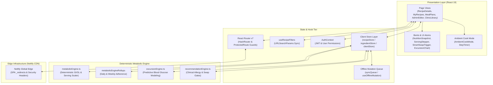

# ⚛️ GlycoGourmet — Frontend Architecture & Engineering Manual

> **React 19 SPA Architecture, Tailwind CSS v4 Theme Engine, Deterministic Metabolic Calculations, and State Lifecycles**  
> *Authored & Architected by [Fotis Pastrakis](https://fotisp.gr)*

---

## 1. Frontend System Topology & Presentation Tier Architecture

GlycoGourmet is engineered as a high-performance, accessible Single Page Application (SPA) built on **React 19** and bundled with **Vite 8**. The presentation tier coordinates client-side routing, state management, and deterministic metabolic calculations:



---

## 2. Frontend Directory Structure Overview (`src/`)

```
src/
├── components/
│   ├── admin/                # Split-pane editor, USDA drawers, audit views
│   ├── common/               # FeatureGate, PwaUpdater, NetworkStatusToast
│   ├── dashboard/            # HealthHeader, MealPlanGlance, MetricCounters
│   ├── dietitian/            # ExcursionForecastModal, ExcursionChart, SmartSwapRuleEditor
│   ├── layout/               # AppLayout, Navbar, NavigationPill
│   ├── nav/                  # DesktopNav, MobileBottomNav
│   ├── patient/              # NotificationOptIn, AdherenceWidget
│   ├── recipe/               # DetailHero, BentoGrid, IngredientsMatrix, ServingStepper, SmartSwapTrigger
│   └── ui/                   # Button, Badge, Modal, OfflineBanner
├── context/
│   ├── AuthContext.jsx       # JWT authentication, session hydration, and demo mode
│   └── UserPreferences.jsx   # UI density (comfortable vs compact) and default filters
├── hooks/
│   ├── useFavorites.js       # Local & remote recipe bookmarking
│   ├── useOfflineMutation.js # Optimistic mutations with background sync
│   ├── usePermissions.js     # RBAC role verification and route gates
│   ├── useRecipeFilters.js   # Bidirectional URLSearchParams synchronization
│   ├── useRecipes.js         # Reactive catalog queries and caching
│   └── useWakeLock.js        # Screen wake-lock API for hands-free kitchen cooking
├── pages/
│   ├── AdminDashboard.jsx    # System metrics and user approval queue
│   ├── AdminEditor.jsx       # Clinical recipe authoring studio
│   ├── AmbientCookMode.jsx   # High-contrast step-by-step cooking companion
│   ├── ClientRoster.jsx      # Dietitian multi-client portfolio management
│   ├── ClinicDashboard.jsx   # Clinic-wide patient cohorts and analytics
│   ├── ClinicLibrary.jsx     # Institutional meal plan and recipe library
│   ├── Dashboard.jsx         # Main discovery catalog and GL budget tracker
│   ├── DraftAuditQueue.jsx   # Side-by-side recipe discrepancy resolution
│   ├── GroceryList.jsx       # Offline-ready grocery checklist manifest
│   ├── Login.jsx / Register.jsx # Authentication portals
│   ├── MealPlans.jsx         # 7-day calendar scheduler and budget gauge
│   ├── MyRecipes.jsx         # Personal drafts and favorited recipes
│   ├── PendingApproval.jsx   # Unapproved account holding screen
│   ├── PlanBuilder.jsx       # 42-slot prescriptive meal plan designer
│   ├── RecipeDetails.jsx     # Full viewport clinical recipe detail view
│   └── Settings.jsx          # Profile, glucose units, and target GL budgets
├── routes/
│   ├── AppRoutes.jsx         # React Router v7 HashRouter route matrix
│   └── ProtectedRoute.jsx    # Role-based access control route interceptor
├── services/
│   ├── excursionEngine.ts    # Postprandial glucose excursion modeling
│   ├── metabolicEngine.ts    # Deterministic GI/GL and portion scaling math
│   ├── recommendationEngine.ts # Smart Swap auto-suggestion rules
│   └── strapiClient.js       # Centralized REST client with JWT management
├── types/
│   ├── domain.ts             # Clinical domain contracts and interfaces
│   └── index.ts              # Core TypeScript type definitions
└── utils/
    ├── clientStore.js        # Dietitian client profiles and calibrations
    ├── exportPipeline.js     # EHR and PDF clinical export generator
    ├── ingredientStore.js    # Master USDA ingredient registry
    ├── notificationEngine.ts # Push notification and bolus reminder scheduling
    ├── recipeStore.js        # Recipe persistence and draft management
    └── syncQueue.ts          # Offline IndexedDB/localStorage mutation queue
```

---

## 3. Tailwind CSS v4 Theme Engine & Styling Architecture

GlycoGourmet utilizes **Tailwind CSS v4** with a native CSS-first configuration model, driven by the `@tailwindcss/vite` plugin.

### 3.1 Configuration & CSS Layer Organization
In Tailwind v4, JavaScript configuration files (`tailwind.config.js`) are deprecated in favor of direct CSS imports and the native `@theme` directive in `src/index.css`:

```css
/* src/index.css */
@import "tailwindcss";

@theme {
  /* Color Tokens - Sage & Grain Palette */
  --color-primary: #325346;
  --color-primary-container: #4A6B5D;
  --color-on-primary: #FFFFFF;
  --color-on-primary-container: #C6EAD8;
  --color-background: #F7FAF8;
  --color-surface: #F7FAF8;
  --color-surface-container-lowest: #FFFFFF;
  --color-surface-container-low: #F1F4F2;
  --color-surface-container: #ECEEED;
  --color-surface-container-high: #E6E9E7;
  --color-surface-container-highest: #E0E3E1;
  --color-on-surface: #181C1B;
  --color-on-surface-variant: #414844;
  --color-outline: #727974;
  --color-outline-variant: #C1C8C3;
  --color-tertiary: #803615;
  --color-tertiary-container: #9E4D2A;
  --color-error: #BA1A1A;
  --color-error-container: #FFDAD6;

  /* Typography Scale */
  --font-sans: "Plus Jakarta Sans", system-ui, sans-serif;
  --font-display: "Plus Jakarta Sans", system-ui, sans-serif;

  /* Border Radius & Base Spacing */
  --radius-sm: 0.25rem;
  --radius-md: 0.75rem;
  --radius-lg: 1rem;
  --radius-xl: 1.5rem;
  --radius-full: 9999px;
}
```

> 💡 **Design System Reference:** For complete hex color tokens, typography scales, 8px grid units, and shadow specs, see [design.md](design.md).

---

### 3.2 Reusable Component Tokens (`@layer components`)
Key clinical UI components defined in `src/index.css`:
- **`.glyco-badge`**: Compact macronutrient and glycemic score display.
- **`.glyco-chip`**: Interactive pill button for occasion facets and dietary tags.
- **`.bento-cell` / `.bento-card`**: Elevated modular cards with subtle border transitions.
- **`.metabolic-badge`**: Chromatic visual indicators (`.metabolic-badge--low`, `--med`, `--high`).
- **`.voice-pulse`**: Animated highlight attached to metabolic badges during 1-Click Smart Swaps.

---

## 4. Deterministic Metabolic Math Engine Specification

Located at `src/services/metabolicEngine.ts`, the engine provides pure, side-effect-free calculations protected against floating-point drift and zero-division singularities.

### 4.1 Net Carbohydrates Clamping Invariant
When dietary fiber exceeds total carbohydrates due to laboratory assay reporting artifacts, net carbohydrates must be strictly clamped to $0.0\text{g}$:

$$\text{NetCarbs}(C, F) = \max\left(0, \operatorname{round}_{1}(C - F)\right)$$

*Where $C \ge 0$ is total carbohydrates (g), $F \ge 0$ is dietary fiber (g), and $\operatorname{round}_{1}(x) = \frac{\operatorname{round}(x \times 10)}{10}$.*

---

### 4.2 Thermal Starch Gelatinization & Retrogradation Multipliers
Cooking methods alter starch crystallinity and enzymatic amylase access. The engine applies an empirical coefficient $M_{\text{prep}}$ to baseline Glycemic Index ($GI_0$):

$$GI_{\text{effective}} = \operatorname{clamp}\left(0, 100, \operatorname{round}\left(GI_0 \times M_{\text{prep}}\right)\right)$$

$$\begin{array}{l|c|l}
\textbf{Preparation State} & \textbf{Multiplier } (M_{\text{prep}}) & \textbf{Biochemical Mechanism} \\
\hline
\text{raw} & 1.00\times & \text{Baseline intact plant cell walls and native starch granules.} \\
\text{steamed} & 1.02\times & \text{Mild moist heat softens hemicellulose with minimal rupture.} \\
\text{sauteed} & 1.05\times & \text{Dry-moist heat with lipid encapsulation slowing digestion.} \\
\text{roasted} & 1.15\times & \text{Dry heat promotes extensive starch gelatinization.} \\
\text{boiled} & 1.20\times & \text{Hydrothermal swelling causes complete amylopectin leaching.} \\
\text{mashed\_processed} & 1.25\times & \text{Mechanical shear + cooking maximizes enzymatic surface area.} \\
\text{cooled} & 0.85\times & \text{Retrogradation re-crystallizes amylose into resistant starch (RS3).}
\end{array}$$

---

### 4.3 Composite Recipe Glycemic Index ($GI_{\text{recipe}}$)
The recipe-level glycemic index is the carbohydrate-weighted average of all constituent ingredients. Zero division is defensively trapped:

$$GI_{\text{recipe}} = \begin{cases} 
0 & \text{if } \sum_{i=1}^{n} NC_i = 0 \\
\operatorname{round}\left(\frac{\sum_{i=1}^{n} (GI_{\text{effective}, i} \times NC_i)}{\sum_{i=1}^{n} NC_i}\right) & \text{if } \sum_{i=1}^{n} NC_i > 0 
\end{cases}$$

---

### 4.4 Recipe Glycemic Load per Serving ($GL_{\text{recipe}}$)
Measures the real physiological glucose impact per consumed portion:

$$GL_{\text{recipe}} = \operatorname{clamp}\left(0, 100, \operatorname{round}\left(\frac{GI_{\text{recipe}} \times \sum_{i=1}^{n} NC_i}{100 \times S}\right)\right)$$

*Where $S \ge 1$ is the number of servings.*

---

### 4.5 Multi-Day Rollup & Weekly Adherence Aggregation
- **`calculateDailyRollup(slots, recipesMap, servingMultipliers)`**: Computes daily cumulative GL, net carbs, and macros across up to 6 meal occasions with portion scaling.
- **`calculateWeeklyAdherence(plan, calibration)`**: Evaluates 7-day adherence against prescribed daily GL target budgets.
- **`applyServingScale(ingredients, multiplier)`**: Scales ingredient weights and macronutrients proportionally while preserving Glycemic Index invariance.

---

## 5. Component Patterns & Dynamic GI/GL Resolution Pipeline

### 5.1 `RecipeDetails.jsx` Resolution Pipeline
In `src/pages/RecipeDetails.jsx`, dynamic glycemic resolution executes in a four-stage pipeline upon every user interaction:

```
[ User Swaps Ingredient OR Adjusts Portion Stepper (0.5x - 2.0x) ]
                               │
                               ▼
 1. Resolve Active IDs: Map original ingredient IDs -> swapped replacement IDs
                               │
                               ▼
 2. Ingest Master Nutrition: Look up USDA macronutrient profiles from Registry
                               │
                               ▼
 3. Execute Engine Scaler: applyServingScale(resolvedIngredients, servingMultiplier)
                               │
                               ▼
 4. Emit Dynamic Nutrition: Update DetailHero, NutritionSnapshot & Bento Grid
```

#### Implementation Pattern:
```jsx
// Resolve current ingredients, taking active swaps into account
const resolvedIngredients = (recipe.ingredients ?? []).map(item => {
  const originalId = item.ingredientId || item.ingredient?.id;
  const currentId = swappedIngredients[originalId] || originalId;
  const ing = getIngredientById(currentId);

  return {
    ingredientId: currentId,
    amount: item.amount,
    unit: item.unit,
    prepState: item.prepState || ing?.defaultPrepState || 'raw',
    originalId,
    name: ing?.name || 'Unknown',
    category: ing?.category || '',
    substitutions: ing?.substitutions || [],
  };
});

// Deterministically compute live scaled nutrition and Glycemic Load
const scaleResult = applyServingScale(resolvedIngredients, servingMultiplier);
const currentNutrition = scaleResult.profile;
```

---

### 5.2 Serving Stepper & Multipliers (`ServingStepper.jsx`)
- Renders four discrete portion multipliers: `0.5x`, `1x`, `1.5x`, `2x`.
- Operates via accessible radio group (`role="radio"`, `aria-checked`).
- Complies with mobile touch target bounding requirements ($\ge 48 \times 48\text{px}$).

---

### 5.3 1-Click Smart Swap Trigger & Telemetry (`SmartSwapTrigger.jsx`)
- Provides immediate 1-click substitution for high-glycemic staples (e.g. White Rice $\to$ Cauliflower Pearl Rice).
- Displays explicit clinical rationale and anticipated GL reduction.
- Triggers active CSS pulse (`.voice-pulse`) on the target Glycemic Load badge upon execution.

> 💡 **Cognitive Ergonomics:** For details on how Smart Swaps reduce decision fatigue and implement Nielsen Norman heuristics, see [UX.md](UX.md).

---

### 5.4 Non-Blocking Sub-Form Drawer Pattern (`CustomIngredientDrawer.jsx`)
- Slides out over the active recipe canvas during authoring.
- Queries USDA FoodData Central in an isolated execution context.
- Ingests new custom ingredients **without resetting or unmounting parent recipe draft state**.

---

## 6. State Management & Custom Hooks Architecture

### 6.1 URL Query Parameter Synchronization (`useRecipeFilters.js`)
Catalog filter states synchronize bidirectionally with browser query strings:

$$\text{URLSearchParams} \underset{\text{deserialization}}{\overset{\text{serialization}}{\longleftrightarrow}} \text{React State } (\text{occasion}, \text{sortOrder}, \text{maxGL})$$

- **Deep Linking:** Direct navigation to `/#/recipes/all?occasion=dinner&maxGL=15&sort=gl-asc` immediately restores filtered catalog views.
- **Debounced Navigation:** Rapid slider changes are debounced by $150\text{ms}$ to prevent history stack pollution.

---

### 6.2 Permission & Role Access Control (`usePermissions.js`)
- Inspects authenticated user state (`roleType`, `isApproved`, `onboarded`).
- Restricts navigation through `ProtectedRoute.jsx`:
  - Standard patients $\to$ Personal Studio (`/#/my-recipes`) and Meal Planner (`/#/meal-plans`).
  - Dietitians $\to$ Client Roster (`/#/dietitian/clients`), Clinic Library (`/#/clinic/library`), and Audit Queue (`/#/audit-queue`).
  - Unapproved registrations $\to$ Verification Gate (`/#/pending-approval`).

---

### 6.3 Global Context Providers
- **`AuthContext.jsx`**: Manages JWT authentication tokens, current user profile, login/logout, and demo mode fallback (`VITE_ENABLE_DEMO_AUTH`).
- **`UserPreferences.jsx`**: Persists UI density preferences (`comfortable` vs `compact`) and default occasion filters.

---

## 7. TypeScript Contracts & Frontend Domain Interfaces

Located at `src/types/domain.ts` and `src/services/metabolicEngine.ts`:

```typescript
export interface MacronutrientProfile {
  kcal: number;
  protein: number;
  fat: number;
  saturatedFat?: number;
  carbs: number;
  fiber: number;
  netCarbs: number;
  glycemicIndex?: number;
  glycemicLoad?: number;
}

export type PrepState =
  | 'raw'
  | 'steamed'
  | 'sauteed'
  | 'roasted'
  | 'boiled'
  | 'mashed_processed'
  | 'cooled';

export interface SmartSwapPairing {
  ingredientId: string;
  name: string;
  reason: string;
  expectedGlReduction?: number;
}

export interface RecipeIngredientItem {
  ingredientId: string;
  amount: number;
  unit: string;
  prepState: PrepState;
  customName?: string;
}

export interface Recipe {
  id: string;
  title: string;
  description: string;
  category: string;
  mealOccasion: 'breakfast' | 'brunch' | 'lunch' | 'dinner' | 'snack' | 'dessert';
  prepTime: number;
  cookTime: number;
  servings: number;
  yield?: string;
  imageUrl?: string;
  status: 'draft' | 'published';
  publishedAt?: string | null;
  authorId?: string;
  ingredients: RecipeIngredientItem[];
  instructions: string[];
  dietaryFlags?: string[];
  tags?: string[];
  glycemicIndex: number;
  glycemicLoad: number;
  glycemicImpact: 'Optimal Low-GI' | 'Moderate Impact' | 'High Spike Risk';
  nutrition: MacronutrientProfile;
}
```

---

## 8. Client-Side Routing & Navigation Matrix

Managed by **React Router v7** using `HashRouter` in `src/routes/AppRoutes.jsx`:

| Route Path | Component View | Access Level | Description |
| :--- | :--- | :--- | :--- |
| `/#/` / `/#/recipes/all` | `Dashboard.jsx` | Public / All | Main Discovery Catalog with filter bar. |
| `/#/recipe/:id` | `RecipeDetails.jsx` | Public / All | Clinical Recipe Detail with portion steppers. |
| `/#/my-recipes` | `MyRecipes.jsx` | Authenticated | User's authored recipe drafts & favorites. |
| `/#/meal-plans` | `MealPlans.jsx` | Authenticated | 7-day meal schedule & GL budget gauge. |
| `/#/grocery-list` | `GroceryList.jsx` | Authenticated | Offline-ready interactive shopping manifest. |
| `/#/cook/:id` | `AmbientCookMode.jsx`| Authenticated | Ambient hands-free step-by-step guidance. |
| `/#/dietitian/clients` | `ClientRoster.jsx` | Dietitian / Admin | Multi-client portfolio management. |
| `/#/clinic/dashboard` | `ClinicDashboard.jsx`| Dietitian / Admin | Institutional patient cohort analytics. |
| `/#/clinic/library` | `ClinicLibrary.jsx` | Dietitian / Admin | Shared institutional meal plan library. |
| `/#/audit-queue` | `DraftAuditQueue.jsx`| Dietitian / Admin | Recipe discrepancy review queue. |
| `/#/admin-editor` | `AdminEditor.jsx` | Dietitian / Admin | USDA ingredient & recipe authoring canvas. |
| `/#/pending-approval` | `PendingApproval.jsx`| Unapproved | Account review holding state. |

> 💡 **Information Architecture:** For complete OOUX domain mappings and persona CTAs, see [information_architecture.md](information_architecture.md).

---

## 9. Build, Optimization & Netlify Edge Deployment

### 9.1 Vite 8 Production Build Pipeline
- **Bundler:** Vite with `@vitejs/plugin-react` and `@tailwindcss/vite`.
- **Command:** `npm run build` outputs optimized ES modules and hashed assets to `dist/`.
- **SPA Fallback:** `dist/_redirects` (`/* /index.html 200`) guarantees client-side hash and deep route resolution on Netlify Edge CDN.

### 9.2 Asset Caching & Optimization
- **Production Asset Chunks (`/assets/*`):** Configured with `Cache-Control: public, max-age=31536000, immutable` for zero redundant transfers.
- **Entrypoint (`/index.html`):** `Cache-Control: public, max-age=0, must-revalidate` for instant deployment updates.

---

## 10. Document Metadata & Attribution

- **Document Version:** `2.0.0`
- **Frontend Lead & Systems Architect:** Fotis Pastrakis ([https://fotisp.gr](https://fotisp.gr))
- **Core Technologies:** React 19, Tailwind CSS v4, React Router v7, Vite 8, Netlify CDN
