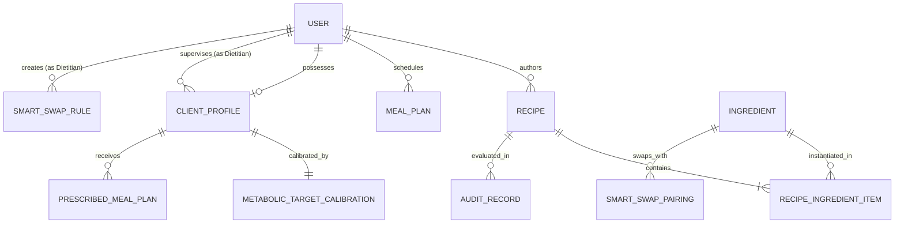

# 📋 GlycoGourmet — Information Architecture & Clinical Data Specification

> **Object-Oriented UX (OOUX / ORCA) Domain Model, Persona Taxonomies, Circadian Meal Categorization, and System Schemas**  
> *Authored & Architected by [Fotis Pastrakis](https://fotisp.gr)*

---

## 1. Executive Summary & Clinical Context

GlycoGourmet is an open-source, clinical-grade digital health application built for individuals managing **Type 1 Diabetes, Type 2 Diabetes, Gestational Diabetes, Prediabetes, or Severe Insulin Resistance**.

Conventional nutritional trackers evaluate food intake primarily through isolated caloric or total carbohydrate metrics. In contrast, GlycoGourmet structures its information architecture around **Glycemic Load ($GL$)**, **Effective Glycemic Index ($GI_{\text{effective}}$)**, and **Thermal Starch Kinetics ($M_{\text{prep}}$)** as primary determinants of postprandial glycemic excursions:

$$\text{Glycemic Load } (GL) = \operatorname{clamp}\left(0, 100, \operatorname{round}\left(\frac{GI_{\text{recipe}} \times \text{NetCarbs}}{100 \times S}\right)\right)$$

*Where $S \ge 1$ is the serving portion count and $\text{NetCarbs} = \max(0, \text{Carbs} - \text{Fiber})$.*

---

## 2. Persona Taxonomy & Clinical Access Profiles

```
+-----------------------------------------------------------------------------------+
|                            GLYCOGOURMET PERSONA SPECTRUM                          |
+-----------------------------------------------------------------------------------+
|  [ PERSONA A: PATIENT ]       [ PERSONA B: CLINICIAN ]    [ PERSONA C: ADMIN ]    |
|  - Active Self-Manager        - Registered Dietitian      - System Clinical Lead  |
|  - Discovery & Filtering       - 42-Slot Meal Plans        - Discrepancy Queue    |
|  - 1-Click Smart Swaps         - Target Calibrations       - Catalog Certification|
|  - Hands-Free Cook Mode        - Tenant-Isolated Clients   - Invariant Auditing   |
+-----------------------------------------------------------------------------------+
```

### 2.1 Persona A: The Patient / Self-Manager (Primary End-User)
- **Clinical Subtypes:** Type 1 Diabetes, Type 2 Diabetes, Gestational Diabetes (GDM), Prediabetes, Severe Insulin Resistance.
- **Cognitive Goals:** Eliminate mental math during meal prep, prevent nocturnal glucose spikes, explore satisfying low-glycemic substitutes, scale portions without recalculating gram ratios.
- **Key Artifacts:** Personal Recipe Studio (`/#/my-recipes`), 7-Day Meal Scheduler (`/#/meal-plans`), Ambient Cook Mode (`/#/cook/:id`).

### 2.2 Persona B: The Clinical Dietitian / RDN (Healthcare Provider)
- **Clinical Scope:** Board-certified dietitians and endocrinology nutritionists managing client cohorts.
- **Clinical Goals:** Calibrate personalized metabolic budgets (daily GL targets, pre-meal thresholds, Insulin Sensitivity Factors, Carb-to-Insulin Ratios), prescribe structured 7-day nutritional plans (42 occasion slots), automate patient-specific smart low-GI swap rules.
- **Key Artifacts:** Client Roster (`/#/dietitian/clients`), Prescriptive Plan Builder (`/#/dietitian/prescriptions`), Smart Swap Rule Studio (`/#/dietitian/rules`), EHR Export Pipeline.

### 2.3 Persona C: The Platform Reviewer & System Administrator
- **Operational Scope:** Clinical content reviewers and database administrators certifying public master recipes.
- **Operational Goals:** Triage nutritional discrepancies between author claims and USDA FoodData Central calculations ($|\Delta| > 1.0\text{g}$), enforce database lifecycles, certify community drafts into the public master catalog.
- **Key Artifacts:** Draft Audit Queue (`/#/audit-queue`), USDA Integration Service, Role Management Control Center.

---

## 3. Object-Oriented UX (OOUX / ORCA) Domain Architecture

The platform architecture is structured around eight core domain entities:



### 3.1 Core Entity Definitions
1. **`Recipe`**: A culinary formula comprising structured ingredient items, preparation instructions, meal occasion taxonomy, and computed metabolic metrics ($GI$, $GL$, macronutrients).
2. **`Ingredient`**: A standardized nutritional building block linked to USDA FoodData Central ground truth, specifying baseline macronutrients per 100g, default preparation states, and low-GI substitutions.
3. **`RecipeIngredientItem`**: A join entity linking an `Ingredient` to a `Recipe` with explicit measurement quantity, culinary unit, and thermal preparation state.
4. **`MealPlan`**: A patient's 7-day schedule mapping recipes to circadian occasion slots with daily cumulative GL aggregation.
5. **`ClientProfile`**: A clinical record storing diabetic subtype classification, assigned dietitian association, and medical history under row-level tenant isolation.
6. **`MetabolicTargetCalibration`**: Personalized metabolic target parameters (daily GL budget, target bolus offset minutes, ISF, CIR).
7. **`PrescribedMealPlan`**: A clinician-authored 7-day meal prescription (42 slots) linked to a specific `ClientProfile`.
8. **`SmartSwapRule`**: A clinician-authored substitution directive (e.g. White Rice $\to$ Cauliflower Rice) automatically applied to patient views.
9. **`AuditRecord`**: An immutable verification log generated during recipe submission comparing author-claimed macros against engine calculations ($|\Delta| > 1.0\text{g}$).

---

## 4. Domain Cardinality & Multiplicity Matrix

| Primary Entity | Target Entity | Relationship | Cardinality | Business Invariant & Cascading Rule |
| :--- | :--- | :--- | :---: | :--- |
| **`User` (Patient)** | **`Recipe`** | Authors | $1 : N$ | Deleting an author reassigns recipes to system archive or sets `authorId = null`. |
| **`Recipe`** | **`Ingredient`** | Contains | $N : M$ | Mediated by `RecipeIngredientItem`; ingredient deletion blocked if referenced in published recipes. |
| **`User` (Patient)** | **`MealPlan`** | Schedules | $1 : N$ | Patient owns historical 7-day plans; active plan updates dynamic header GL budget. |
| **`User` (Dietitian)**| **`ClientProfile`**| Manages | $1 : N$ | Enforced via row-level tenant boundary (`is-dietitian-owner`); dietitians cannot view unassigned clients. |
| **`ClientProfile`** | **`Calibration`** | Calibrated By | $1 : 1$ | Every client profile possesses exactly one active metabolic calibration entity. |
| **`ClientProfile`** | **`Prescription`** | Receives | $1 : N$ | Clinician can author multiple historical 7-day prescriptions for an assigned client. |
| **`Recipe`** | **`AuditRecord`** | Evaluated In | $1 : 0..1$ | Generated whenever author-submitted macros deviate from USDA ground truth by $> 1.0\text{g}$. |

---

## 5. Object Call-To-Action (CTA) Matrix

| Domain Object | Patient / Self-Manager | Clinical Dietitian | Platform Reviewer / Admin |
| :--- | :--- | :--- | :--- |
| **`Recipe`** | View, Filter, Scale Portions ($0.5\times-2\times$), 1-Click Swap, Add to Plan, Launch Cook Mode, Draft Creation. | Author Clinical Drafts, Edit Prescriptions, Certify Ingredients, Add Clinical Rationale. | Full CRUD, Publish / Unpublish, Bypass Discrepancy Gate, Force USDA Recalculation. |
| **`Ingredient`**| View Micronutrients, Select Substitutions, Query USDA via Non-Blocking Drawer. | Create Custom Ingredients, Configure Swap Pairings, Set Clinical Warnings. | Audit Ingredient Registry, Trigger Automated USDA Resync, Delete Orphaned Items. |
| **`MealPlan`** | Schedule Recipes, Duplicate Day, Monitor Daily GL Budget Gauge, Track Weekly Adherence. | View Patient Adherence Telemetry, Recommend Plan Adjustments. | System-wide Aggregated Analytics (anonymized cohort adherence). |
| **`ClientProfile`**| View Assigned Dietitian, View Calibrated GL Target and Bolus Offsets. | Create Client, Update Diabetic Subtype, Adjust ISF/CIR, Export EHR Records. | Tenant Boundary Auditing, Reassign Clients between Clinicians. |
| **`AuditRecord`** | View Rejection Rationale on Drafts, 1-Click Sync Draft to USDA Ground Truth. | Inspect Side-by-Side Macro Discrepancies, Override Minor Tolerances. | Approve / Certify Discrepant Drafts, Reject with Clinical Feedback. |

---

## 6. Circadian Meal Taxonomy & Classification Matrix

GlycoGourmet segments daily food intake across a **6-occasion circadian taxonomy**, reflecting chronobiological insulin sensitivity fluctuations:

```
Circadian Meal Rhythm (24h Timeline):
06:00 ----------- 10:00 ----------- 13:00 ----------- 17:00 ----------- 20:00 ----------- 22:00
[   BREAKFAST   ] [    BRUNCH     ] [     LUNCH     ] [     SNACK     ] [    DINNER     ] [    DESSERT    ]
[  Morning Peak ] [ Transition    ] [ Afternoon     ] [ Glucose Brid ] [ Evening Rest  ] [ Strict Low GL ]
```

| Meal Occasion | Physiological & Chronobiological Rationale | Target Max GL | Recommended Preparation Multiplier |
| :--- | :--- | :---: | :--- |
| **`breakfast`** | Dawn phenomenon & morning cortisol surge; prioritizes low-carb, protein-rich items. | $\le 8$ | Raw, Sauteed ($1.00\times - 1.05\times$) |
| **`brunch`** | Late morning weekend intake; balanced complex carbs with lipid encapsulation. | $\le 12$ | Steamed, Sauteed ($1.02\times - 1.05\times$) |
| **`lunch`** | Midday sustained energy; complex legumes and whole intact grains. | $\le 15$ | Boiled, Steamed ($1.02\times - 1.20\times$) |
| **`snack`** | Pre-exercise or bridge intake; minimal postprandial glucose excursion. | $\le 5$ | Raw ($1.00\times$) |
| **`dinner`** | Evening reduced insulin sensitivity; minimizes nocturnal hyper/hypoglycemia. | $\le 12$ | Roasted, Cooled RS3 ($0.85\times - 1.15\times$) |
| **`dessert`** | Evening treat; strict glycemic clamping with non-nutritive keto pairings. | $\le 4$ | Cooled ($0.85\times$) |

---

## 7. Dynamic Semantic Tags & Dietary Flag System

Recipes are indexed with deterministic clinical flags generated from constituent ingredients:

| Semantic Tag | Deterministic Validation Rule | Clinical Indication |
| :--- | :--- | :--- |
| **`Optimal Low-GI`** | Composite $GI \le 35$ and Serving $GL \le 5$. | Maximizes postprandial glucose stability across all diabetes types. |
| **`Keto / Very Low Carb`** | Total Net Carbs per serving $\le 5.0\text{g}$. | Ketogenic metabolic therapies & severe insulin resistance. |
| **`Gluten-Free`** | Contains zero wheat, barley, rye, or triticale derivatives. | Celiac disease & non-celiac gluten sensitivity co-morbidities. |
| **`Dairy-Free`** | Contains zero cow/goat/sheep milk derivatives. | Lactose intolerance & dairy protein allergies. |
| **`Resistant Starch (RS3)`**| Preparation state includes `cooled` starchy tubers/grains ($M_{\text{prep}} = 0.85\times$). | Colon microbiome fermentation & blunted glucose absorption. |

---

## 8. Preattentive Visual Feedback & WCAG 2.1 Contrast Matrix

Visual feedback is processed in $< 200\text{ms}$ by the human visual cortex, allowing subconscious glycemic evaluation before numerical analysis:

```
Glycemic Load (GL) Spectrum:
0 ---------------- 10 ----------------- 19 ----------------- 100+
[ LOW GL (<= 10)  ] [  MED GL (11 - 19)  ] [   HIGH GL (>= 20)  ]
[   SAGE GREEN    ] [       AMBER        ] [     ERROR ROSE     ]
[ #1B3B22/#386A20 ] [      #9E4D2A       ] [      #BA1A1A       ]
[ "Gentle Impact" ] [ "Moderate Impact"  ] [ "High Spike Risk"  ]
```

### WCAG 2.1 AA / AAA Contrast Certification Table:
| Semantic Token | Foreground Hex | Background Surface | Contrast Ratio | Compliance Level |
| :--- | :---: | :---: | :---: | :---: |
| **Deep Pine (`--color-pine-900`)** | `#1B3B22` | Grain Ivory (`#F6F4EE`) | **$10.8 : 1$** | ✅ Passes (Exceeds AAA) |
| **Glyco Sage (`--color-sage-700`)** | `#386A20` | Soft Sage (`#D8E8CB`) | **$4.8 : 1$** | ✅ Passes (Exceeds AA) |
| **Forest Moss (`--color-moss-800`)** | `#2D5A34` | Soft Sage (`#D8E8CB`) | **$5.4 : 1$** | ✅ Passes (Exceeds AA) |
| **Amber Alert (`--color-tertiary`)** | `#9E4D2A` | Amber Container (`#FFDBCF`) | **$5.1 : 1$** | ✅ Passes (Exceeds AA) |
| **Error Rose (`--color-error`)** | `#BA1A1A` | Error Container (`#FFDAD6`) | **$5.8 : 1$** | ✅ Passes (Exceeds AA) |

---

## 9. Navigation Architecture & Action-Oriented Triad

```
                                  [ Global Navigation ]
                                            │
        ┌───────────────────────────────────┼───────────────────────────────────┐
        ▼                                   ▼                                   ▼
[ 1. Discovery Catalog ]         [ 2. Personal Studio ]             [ 3. Meal Scheduler ]
  - /#/recipes/all                 - /#/my-recipes                    - /#/meal-plans
  - Occasion Facets                - Authored Drafts                  - 7-Day Grid Matrix
  - Dual-Badge Cards               - Favorited Recipes                - GL Budget Gauge
        │                                   │                                   │
        ▼                                   ▼                                   ▼
  /#/recipe/:id                     /#/admin-editor                    /#/cook/:id
  - Detail Hero & Bento             - Split-Pane Canvas                - Ambient Cook Mode
  - Smart Swap Trigger              - USDA Live Search                 - Hands-Free Timers
```

- **Clinician Workspace:** `/#/dietitian/clients` (Roster), `/#/dietitian/prescriptions` (Plan Builder), `/#/audit-queue` (Discrepancy Resolution).
- **Security Gates:** `/#/pending-approval` (Verification holding pattern for unapproved accounts).

---

## 10. Current Implementation State & Future Development Roadmap

### 10.1 Delivered Capabilities (Chunks 1–16 / v2.0.0)
- **Deterministic Metabolic Calculation Engine:** Net Carbs clamping, thermal starch prep multipliers ($1.00\times-1.25\times, 0.85\times$), weighted recipe GI, and multi-day GL rollups.
- **Headless CMS & Tenancy:** Strapi v4/v5 backend with row-level tenant boundary isolation (`is-dietitian-owner.js`) and database lifecycle invariant guards.
- **Cognitive Ergonomic UI:** Action-Oriented Triad, Metabolic Bento Grid, Discrete Serving Steppers ($0.5\times, 1.0\times, 1.5\times, 2.0\times$), 1-Click Smart Low-GI Swaps, and Hands-free Cook Mode.
- **Dual-Sided Clinical Platform:** Dietitian Client Roster, 42-slot Prescriptive Plan Builder, Side-by-side Draft Audit Queue with 1-click USDA synchronization.
- **100% Quality Assurance:** 281 passing unit and integration tests (Vitest), multi-browser Playwright E2E matrix, and WCAG 2.1 AA contrast certification.

---

### 10.2 Future Development Roadmap (Phases 1–6)

```
+-----------------------------------------------------------------------------------+
|                        GLYCOGOURMET FUTURE DEVELOPMENT ROADMAP                    |
+-----------------------------------------------------------------------------------+
|  [ PHASE 1: MOBILE PWA ]       [ PHASE 2: CGM TELEMETRY ]  [ PHASE 3: MULTI-TENANT ]|
|  - Offline SQLite Sync         - Dexcom / Libre API Sync   - Clinic Organization Roster|
|  - Background Push Timers      - Postprandial Correlation  - White-Label Portals   |
|                                                                                   |
|  [ PHASE 4: PREDICTIVE ML ]    [ PHASE 5: SMART KITCHEN ]  [ PHASE 6: EHR EXPORT ] |
|  - Bolus Excursion Modeling    - BLE Kitchen Scale Pairing - FHIR / SMART on FHIR  |
|  - Auto-Tune Target Budgets    - Guided Cook Auto-Weight   - Epic / Cerner Ingestion|
+-----------------------------------------------------------------------------------+
```

1. **Phase 1 — Mobile PWA & Offline Sync:** Background service worker caching, offline recipe drafting with optimistic synchronization.
2. **Phase 2 — Continuous Glucose Monitor (CGM) Telemetry:** Integration with Dexcom G7, Abbott Freestyle Libre 3 APIs to overlay real-time postprandial glucose curves onto consumed recipe GL profiles.
3. **Phase 3 — Enterprise Multi-Tenancy:** Multi-clinic organizational accounts, shared institutional recipe libraries, and tiered billing structures.
4. **Phase 4 — Predictive Metabolic Machine Learning:** Machine learning models forecasting personalized blood glucose trajectories based on meal composition, ISF, CIR, and physical activity.
5. **Phase 5 — Smart Kitchen BLE Hardware Integration:** Bluetooth-enabled smart food scale integration for real-time automatic ingredient mass transmission.
6. **Phase 6 — Clinical EHR Ingestion (SMART on FHIR):** Bi-directional health record exchange conforming to HL7 FHIR standards for seamless hospital and endocrinology clinic integration.

---

## 11. Document Metadata & Attribution

- **Document Version:** `2.0.0`
- **Author & System Architect:** Fotis Pastrakis ([https://fotisp.gr](https://fotisp.gr))
- **Methodology:** Sophia Prater Object-Oriented UX (OOUX / ORCA), Nielsen Norman Group UX Heuristics, WCAG 2.1 Level AA/AAA
- **Repository:** `https://github.com/ux-fotisp/GlycoGourmet`
