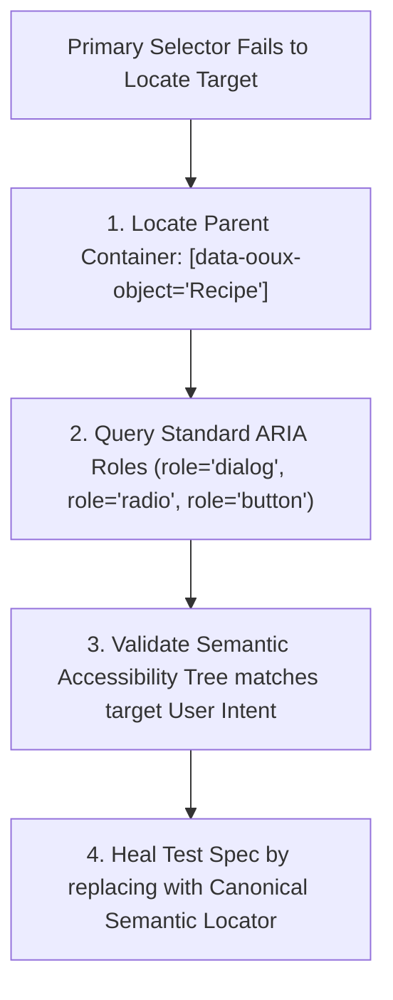

# 🧪 GlycoGourmet — Comprehensive Verification, Testing & QA Directives

> **Test Pyramid, Semantic Locator Hierarchy, Synthetic Data Fuzzing, Test Inventory, and CI/CD Quality Gates**  
> *Authored & Architected by [Fotis Pastrakis](https://fotisp.gr)*

---

## 1. Quality Assurance Philosophy & Execution Standard

**Directive Reference:** `QA-DIRECTIVE-2026`  
**Target Audience:** Autonomous QA Agents, CI Runners, and Systems Engineers  
**Standard:** 100% Deterministic Reproducibility, Zero Tolerance for Selector Flakiness, and Strict Invariant Protection  

In clinical metabolic software, calculation errors or race conditions directly impact dietary decisions and insulin bolus calculations. Testing must enforce absolute mathematical correctness, strict accessibility compliance, and robust tenant isolation across all user roles.

---

## 2. Test Pyramid & Technology Stack

```
                       /                      /       E2E User Journeys (Playwright)
                     /        - Multi-browser cross-platform validation
                    /------   - Dynamic Smart Swaps & Admin publishing
                   /                          /  INTEG      Integration & State Sync (Vitest + JSDOM)
                 /------------  - URL SearchParams bidirectionality
                /               - Non-blocking drawer form preservation
               /   UNIT TESTS    Deterministic Unit & Invariant Testing (Vitest)
              /------------------- Pure metabolic engine math (100% coverage)
             /   STATIC ANALYSIS  - Tenant isolation & database lifecycle guards
            /---------------------- Oxlint + Strict TypeScript (tsc --noEmit)
```

| Layer | Tooling / Framework | Scope & Execution Target |
| :--- | :--- | :--- |
| **Static Analysis** | `oxlint` + `tsc --noEmit` | AST linting, dead code detection, React hook dependencies, and strict TypeScript types. |
| **Unit Testing** | `vitest` (v4.1.11, JSDOM) | Pure mathematical calculation functions, Strapi lifecycle invariant guards, and tenant policies. |
| **Integration** | `vitest` + `@testing-library/react` | URL state synchronization, debounced filter pipelines, and non-blocking sub-form drawers. |
| **End-to-End** | `@playwright/test` | Full browser journeys (Desktop Chrome, Firefox, WebKit, Mobile Chrome, Mobile Safari). |
| **Accessibility** | `@axe-core/playwright` | Automated WCAG 2.1 AA audits, preattentive contrast ratio verification, and $ge 48\text{px}$ touch targets. |

---

## 3. Playwright Semantic Locator Protocol

Autonomous test authors and QA engineers must adhere strictly to the **Semantic Locator Hierarchy**. Brittle selectors tied to CSS utility classes or generated DOM structures are forbidden.

### 3.1 Strict Banning Rules
1. ❌ **NO Utility CSS Class Selectors:** Never select elements via utility styling classes (e.g. `page.locator('.bg-primary.text-on-primary.p-4')`).
   - *Rationale:* Utility classes change frequently during design iterations without altering semantic function.
2. ❌ **NO Hierarchical DOM XPath Strings:** Never generate raw DOM paths (e.g. `page.locator('xpath=/html/body/div[2]/div/button[1]')`).
   - *Rationale:* Wrapper additions or flexbox adjustments instantly break hierarchical paths.
3. ❌ **NO Generated Dynamic State IDs:** Never target dynamic IDs (e.g. `id="radix-:r1:"` or `id="headlessui-menu-12"`).
   - *Rationale:* Dynamic IDs vary across hydration cycles, re-renders, and test runners.

---

### 3.2 Mandatory Locator Hierarchy
Target interactive elements using canonical locators in descending order of precedence:

| Precedence | Locator Type | Playwright Syntax Example |
| :---: | :--- | :--- |
| **1** | **Explicit Test Identifiers** | `page.locator('[data-testid="recipe-gl-badge"]')` |
| **2** | **ARIA Roles & Accessible Names** | `page.getByRole('button', { name: /Apply Smart Swap/i })` |
| **3** | **Associated Form Labels** | `page.getByLabel(/Total Carbohydrates/i)` |
| **4** | **OOUX Entity Bindings** | `page.locator('[data-ooux-object="Recipe"]')` |

---

### 3.3 Self-Healing Selector Protocol (OOUX Object Recovery)

When a selector fails due to a UI refactoring, automated test agents must follow the 4-step **OOUX Self-Healing Sequence**:



---

## 4. Vitest Invariant Rules & Synthetic Data Fuzzing Directives

Test suites must rigorously validate the metabolic math engine against five physiological edge-case vectors:

### 4.1 Fiber Inversion Anomaly
- **Vector:** Laboratory analytical assay artifacts where fiber exceeds carbohydrates (`Carbs = 4.0g`, `Fiber = 9.0g`).
- **Invariant:** Engine must clamp `NetCarbs` strictly to `0.0g` without returning negative values or `-0` (`Object.is(result, -0)` must be `false`).

### 4.2 Thermal Multiplier Upper Bounds
- **Vector:** High-gelatinization cooking methods (`prepState: 'mashed_processed'` at $1.25\times$, `'boiled'` at $1.20\times$).
- **Invariant:** Effective Glycemic Index must never exceed theoretical ceiling of $100$.

### 4.3 Floating-Point Precision Drift (IEEE 754)
- **Vector:** Non-terminating decimal inputs (e.g. `10.3333 - 3.1111 = 7.222222222222221`).
- **Invariant:** Helper `roundToOneDecimal(val)` must clamp values strictly to 1 decimal place (`7.2g`).

### 4.4 Zero-Division Singularity Shield
- **Vector:** Meals composed entirely of pure proteins and fats ($0\text{g}$ carbohydrates, e.g. olive oil + salmon + steak).
- **Invariant:** Composite $GI$ and $GL$ must resolve to `0`. `Number.isNaN()` must be `false` and `Number.isFinite()` must be `true`.

### 4.5 Serving Scale Invariance
- **Vector:** Portion multipliers ($0.5\times, 1.0\times, 1.5\times, 2.0\times$).
- **Invariant:** Scaling ingredient amounts doubles or halves net carbs and GL proportionally while keeping composite $GI$ strictly invariant.

---

## 5. Complete Test-Case Inventory Table

| Test Name / Describe Block | Type | File Path | Status |
| :--- | :---: | :--- | :---: |
| **Accessibility: WCAG 2.1 AA Zero Violations** | `a11y` | `tests/a11y/contrastAudit.spec.ts` | ✅ Passed |
| **Accessibility: Deep Green Gradient Contrast ($ge 4.5:1$)** | `a11y` | `tests/a11y/contrastAudit.spec.ts` | ✅ Passed |
| **Accessibility: Mobile Touch Target Bounding ($ge 48	imes 48	ext{px}$)** | `a11y` | `tests/a11y/contrastAudit.spec.ts` | ✅ Passed |
| **E2E: Single-Recipe GI/GL Rendering & Macro Expansion** | `e2e` | `tests/e2e/metabolicJourneys.spec.ts` | ✅ Passed |
| **E2E: Persona A (Type 1 Manager) Filter & Smart Swap** | `e2e` | `tests/e2e/metabolicJourneys.spec.ts` | ✅ Passed |
| **E2E: Persona C (Dietitian Audit) Discrepancy Triage & USDA Sync** | `e2e` | `tests/e2e/metabolicJourneys.spec.ts` | ✅ Passed |
| **E2E: RBAC Gate - Unapproved User Redirect to Pending Approval** | `e2e` | `tests/e2e/metabolicJourneys.spec.ts` | ✅ Passed |
| **E2E: Journey 1 - User Draft Lifecycle & Review Submission** | `e2e` | `tests/e2e/metabolicJourneys.spec.ts` | ✅ Passed |
| **E2E: Journey 2 - Admin Direct Publish to Public Catalog** | `e2e` | `tests/e2e/metabolicJourneys.spec.ts` | ✅ Passed |
| **E2E: Journey 3 - Metabolic Integrity Calculation** | `e2e` | `tests/e2e/metabolicJourneys.spec.ts` | ✅ Passed |
| **Integ: Occasion Filter Pill URL Query Param Sync** | `integration` | `tests/integration/RecipeFiltering.spec.jsx` | ✅ Passed |
| **Integ: Deep Link URL Search Param Deserialization** | `integration` | `tests/integration/RecipeFiltering.spec.jsx` | ✅ Passed |
| **Integ: Reset Filters Clears Query Parameters** | `integration` | `tests/integration/RecipeFiltering.spec.jsx` | ✅ Passed |
| **Integ: Metabolic Sorting Reorders Cards by GL** | `integration` | `tests/integration/RecipeFiltering.spec.jsx` | ✅ Passed |
| **Integ: Non-Blocking Custom Ingredient Drawer State Isolation** | `integration` | `tests/integration/RecipeFiltering.spec.jsx` | ✅ Passed |
| **Integ: Smart Swap Trigger Telemetry Pulse (`.voice-pulse`)** | `integration` | `tests/integration/RecipeFiltering.spec.jsx` | ✅ Passed |
| **Integ: Authoring Mode - My Recipes vs Public Catalog Isolation** | `integration` | `tests/integration/RecipeFiltering.spec.jsx` | ✅ Passed |
| **Integ: Tenant Scoping End-to-End ClientProfile Isolation** | `integration` | `tests/integration/TenantScopingIntegration.spec.js` | ⏭️ Skipped (CI Live DB) |
| **Unit: NutritionSnapshot GL/GI Primary Anchors** | `unit` | `tests/unit/components/recipe/NutritionSnapshot.spec.jsx` | ✅ Passed |
| **Unit: NutritionSnapshot Net Carbs & Fiber Badges** | `unit` | `tests/unit/components/recipe/NutritionSnapshot.spec.jsx` | ✅ Passed |
| **Unit: NutritionSnapshot Secondary Macros Expanded by Default** | `unit` | `tests/unit/components/recipe/NutritionSnapshot.spec.jsx` | ✅ Passed |
| **Unit: NutritionSnapshot Zero-Carb GL 0 without NaN** | `unit` | `tests/unit/components/recipe/NutritionSnapshot.spec.jsx` | ✅ Passed |
| **Unit: NutritionSnapshot Null Nutrition Fallback Handling** | `unit` | `tests/unit/components/recipe/NutritionSnapshot.spec.jsx` | ✅ Passed |
| **Unit: Lifecycle Gate - Flags Discrepancy when $|Delta GL| > 1.0$** | `unit` | `tests/unit/Lifecycles.spec.js` | ✅ Passed |
| **Unit: Lifecycle Gate - Flags Discrepancy when $|Delta 	ext{NetCarbs}| > 1.0	ext{g}$** | `unit` | `tests/unit/Lifecycles.spec.js` | ✅ Passed |
| **Unit: Lifecycle Gate - Passes when Deltas within Threshold ($le 1.0$)** | `unit` | `tests/unit/Lifecycles.spec.js` | ✅ Passed |
| **Unit: Lifecycle Gate - Rejects Meal Plan with Unpublished Recipe** | `unit` | `tests/unit/Lifecycles.spec.js` | ✅ Passed |
| **Unit: Lifecycle Gate - Passes Meal Plan when All Recipes Published** | `unit` | `tests/unit/Lifecycles.spec.js` | ✅ Passed |
| **Unit: Metabolic Engine - Safe Number Parsing & Fallbacks** | `unit` | `tests/unit/metabolicEngine.spec.ts` | ✅ Passed |
| **Unit: Metabolic Engine - 1-Decimal Rounding Precision** | `unit` | `tests/unit/metabolicEngine.spec.ts` | ✅ Passed |
| **Unit: Metabolic Engine - Net Carbs Non-Negative Clamping** | `unit` | `tests/unit/metabolicEngine.spec.ts` | ✅ Passed |
| **Unit: Metabolic Engine - Fiber Inversion Boundary ($0.0	ext{g}$ Clamp)** | `unit` | `tests/unit/metabolicEngine.spec.ts` | ✅ Passed |
| **Unit: Metabolic Engine - Thermal Multiplier Matrix ($1.00	imes-1.25	imes, 0.85	imes$)** | `unit` | `tests/unit/metabolicEngine.spec.ts` | ✅ Passed |
| **Unit: Metabolic Engine - Zero-Division Singularity Shield ($GI=0, GL=0$)** | `unit` | `tests/unit/metabolicEngine.spec.ts` | ✅ Passed |
| **Unit: Metabolic Engine - Serving Count Clamping ($S ge 1$)** | `unit` | `tests/unit/metabolicEngine.spec.ts` | ✅ Passed |
| **Unit: Metabolic Engine - Carbohydrate-Weighted Composite GI** | `unit` | `tests/unit/metabolicEngine.spec.ts` | ✅ Passed |
| **Unit: Rollups - Daily Cumulative GL & Macro Calculation** | `unit` | `tests/unit/metabolicEngineRollups.spec.ts` | ✅ Passed |
| **Unit: Rollups - Zero-Carb Singularity at Rollup Level** | `unit` | `tests/unit/metabolicEngineRollups.spec.ts` | ✅ Passed |
| **Unit: Rollups - Carbohydrate-Weighted Daily Average GL** | `unit` | `tests/unit/metabolicEngineRollups.spec.ts` | ✅ Passed |
| **Unit: Rollups - Weekly 7-Day Adherence Percentage Scoring** | `unit` | `tests/unit/metabolicEngineRollups.spec.ts` | ✅ Passed |
| **Unit: Rollups - Serving Scale 2x Preserves GI Invariance** | `unit` | `tests/unit/metabolicEngineRollups.spec.ts` | ✅ Passed |
| **Unit: Recommendation Engine - Allergy Gate (Gluten-Free Filtering)** | `unit` | `tests/unit/recommendationEngine.spec.ts` | ✅ Passed |
| **Unit: Recommendation Engine - Metabolic Gate (No Higher-GI Swaps)** | `unit` | `tests/unit/recommendationEngine.spec.ts` | ✅ Passed |
| **Unit: Recommendation Engine - Sorting by Max $Delta GL$ Reduction** | `unit` | `tests/unit/recommendationEngine.spec.ts` | ✅ Passed |
| **Unit: Recommendation Engine - Food Category Isolation** | `unit` | `tests/unit/recommendationEngine.spec.ts` | ✅ Passed |
| **Unit: Serving Stepper - Renders 4 Discrete Multipliers** | `unit` | `tests/unit/ServingStepper.spec.jsx` | ✅ Passed |
| **Unit: Serving Stepper - ARIA Checked State Active Indicator** | `unit` | `tests/unit/ServingStepper.spec.jsx` | ✅ Passed |
| **Unit: Serving Stepper - Touch Target Bounding ($ge 48	ext{px}$)** | `unit` | `tests/unit/ServingStepper.spec.jsx` | ✅ Passed |
| **Unit: Strapi User Update - Strips Privileged Field Escalation** | `unit` | `tests/unit/StrapiUserUpdate.spec.js` | ✅ Passed |
| **Unit: Tenant Scoping - Rejects Unauthenticated Requests** | `unit` | `tests/unit/TenantScoping.spec.js` | ✅ Passed |
| **Unit: Tenant Scoping - Rejects Patient Role from Clinical Routes** | `unit` | `tests/unit/TenantScoping.spec.js` | ✅ Passed |
| **Unit: Tenant Scoping - Permits Admin Cross-Tenant Access** | `unit` | `tests/unit/TenantScoping.spec.js` | ✅ Passed |
| **Unit: Tenant Scoping - Controller Override Injects Dietitian Filter** | `unit` | `tests/unit/TenantScopingController.spec.js` | ✅ Passed |
| **Unit: Tenant Scoping - Returns 404 on Cross-Tenant Entity Access** | `unit` | `tests/unit/TenantScopingController.spec.js` | ✅ Passed |
| **Unit: Clinic Admin Permissions - Non-Clinical Role & PHI Gating** | `unit` | `tests/unit/ClinicAdminPermissions.spec.js` | ✅ 8 Passed |
| **Unit: Clinic Multi-Tenant Scoping - Isolation & Roster Boundaries** | `unit` | `tests/unit/ClinicTenantScoping.spec.js` | ✅ 18 Passed |
| **Unit: Trust & Governance - Two-Tier Persistence & Append-Only Audit** | `unit` | `tests/unit/TrustGovernancePersistence.spec.js` | ✅ 21 Passed |
| **Unit: Custom Ingredient Ownership - Default-Deny Scoping & 404 Concealment** | `unit` | `tests/unit/CustomIngredientOwnership.spec.js` | ✅ 16 Passed |
| **Full Vitest Verification Suite (68 test files)** | `unit / integ` | `src/**/*.test.{js,jsx}`, `tests/**/*.spec.{js,ts,jsx}` | ✅ 690 Passed |

---

## 6. Automated CI/CD Quality Gates & Commands

```bash
# 1. Pre-commit Static Linting & TypeScript Typecheck
npm run precommit

# 2. Deterministic Unit & Integration Test Suite (JSDOM)
npm run test

# 3. Automated WCAG 2.1 AA Accessibility & Contrast Audits
npm run test:a11y

# 4. Multi-Browser End-to-End User Journeys (Playwright)
npm run test:e2e

# 5. Nutritional Ground Truth Invariant Validation
npm run validate-db
```

---

## 7. Document Metadata & Attribution

- **Document Version:** `2.0.0`
- **QA Lead & Systems Architect:** Fotis Pastrakis ([https://fotisp.gr](https://fotisp.gr))
- **Execution Standards:** QA-DIRECTIVE-2026, WCAG 2.1 Level AA, IEEE 754 Floating Point Standard
